# Introduction_Processing
This respository is a french introduction to the Processing programming language

Vous pouvez retrouver l'ensemble du code décrit ici dans ce dépôt [github](https://github.com/b2renger/Introduction_Processing)

Notes : 
* Le dossier "bonus" propose des outils à usage spécifique. Les explications sont disponnibles dans le code sous forme de commentaires.
* Ce document ne se veut pas exhaustif, il présente les fonctions principales dont nous aurons l’utilité dans le cadre de ce cours. Processing étant très bien documenté il est très facile de trouver de nombreux tutoriels en ligne sur les différents aspects du programme. Se référer à la section « Ressources » pour plus d’informations.
* Ce document a pour but de rappeler les informations vues en cours sous une autre forme et d'en apporter de nouvelles, sa lecture doit donc s’accompagner des exemples de code construits pendant le module.


# Contenu

* [Introduction](#Introduction)<br>
* [L'IDE](#L'IDE)<br>
* [Premier Programme](#Premier-Programme)<br>
* [Les variables](#Les-variables)<br>
  * [Définition](#définition)<br>
  * [Différents types de variables](#Differents-types-de-variables)<br>
  * [La portée des variables](#La-portee-des-variables-ou-le-scope)<br>
  * [Exemple d’utilisation des variables](#Exemple-d’utilisation-des-variables)<br>
  * [Variables globales de processing](#Variables-globales-de-processing)<br>
* [L’aléatoire](#Le-hasard)<br>
  * [random()](#random)<br>
  * [noise()](#noise)<br>
  * [randomSeed() et noiseSeed()](#randomSeed()-et-noiseSeed())<br>
* [Les boucles](#Les-boucles)<br>
  * [for()](#for)<br>
  * [while()](#while)<br>
  * [Exemple](#exemple)<br>
* [Les principes de bases des couleurs](#Les-principes-de-bases-des-couleurs)<br>
  * [Niveaux de gris](#Niveaux-de-gris)<br>
  * [Mode RGB](#Le-mode-rgb)<br>
  * [Mode HSB](#Le-mode-hsb)<br>
  * [Transparence](#La-transparence)<br>
* [Primitives de dessin](#Primitives-de-dessin)<br>
  * [Les instructions de dessin](#Les-instructions-de-dessin)<br>
  * [Les primitves - formes classiques](#Les-primitves---formes-classiques)<br>
  * [Les vertices - formes sur mesure](#Les-vertices---formes-sur-mesure)<br>
* [Les Transformations de l’espace](#Les-transformations-de-l’espace)<br>
  * [translate()](#translate)<br>
  * [rotate()](#rotate)<br>
* [Coder ses propres fonctions](#Coder-ses-propres-fonctions)<br>
* [Interactions avec la souris et le clavier](#Interactions-avec-la-souris-et-le-clavier)<br>
  * [Souris](#souris)<br>
    * [Les variables relatives à la souris](#Les-variables-relatives-a-la-souris)<br>
    * [Les fonctions relatives a la souris](#Les-fonctions-relatives-a-la-souris)<br>
  * [map()](#map)<br>
  * [Clavier](#clavier)<br>
    * [Dessiner du texte et utiliser des polices de caractère](#Dessiner-du-texte-et-utiliser-des-polices-de-caractere)<br>
* [Les Classes Programmation Orientéee Objet](#Les-Classes-et-la-Programmation-Orientee-Objet)<br>
  * [Structure d'une classe](#Structure-d'une-classe)<br>
  * [Construction d’une classe simple](#Construction-d'une-classe-simple)<br>
    * [Déclaration de variables](#Declaration-de-variables)<br>
    * [Constructeur et initialisation](#Constructeur-et-initialisation)<br>
    * [Méthodes complémentaires : update() et draw()](#Methodes-update()-et-draw())<br>
  * [Utilisation d’une classe simple](#Utilisation-d'une-classe-simple)<br>
  * [Les Tableaux pour y stocker des instances de classe](#Les-Tableaux-pour-stocker-des-instances-de-classe)<br>
  * [Emergence - un programme interactif graphiquement complexe avec un algorithme simple](#Emergence---un-programme-interactif-graphiquement-complexe-avec-un-algorithme-simple)<br>
* [Travailler avec les images](#Travailler-avec-les-images)<br>
  * [Charger et afficher une image](#Charger-et-afficher-une-image)<br>
  * [Acceder aux pixels](#Acceder-aux-pixels)<br>
  * [Explosion de pixels en 3D](#Explosion-de-pixels-en-3D)<br>
* [Les Librairies](#Les-Librairies)<br>
  * [Installation d'une librairie](#installation)<br>
  * [ControlP5 pour la creation de GUI ](#ControlP5-pour-la-creation-de-GUI )<br>
  * [OSCP5 pour la communication entre divers programmes](#OSCP5-pour-la-communication-avec-d’autres-programmes)<br>
  * [3D et audio réactif avec Pure-Data](#3D-et-audio-reactif-avec-Pure-Data)<br>
* [Trucs et astuces](#Trucs-et-astuces)<br>
* [Ressources](#Ressources)<br>
* [Références](#References)<br>


## Introduction

Processing est un langage de programmation basé sur java et principalement destiné à la création
graphique. Il est apparut en 2001, crée par deux artistes Ben Fry et Casey Reas, alors étudiants au
MIT. Il reprend une partie des concepts de Design by Numbers l’environnement de programmation
graphique developpé par John Maeda au sein du Média Lab du même MIT.

Le langage processing est du Java fortement simplifié par l’accès direct à de nombreuses primitives
de dessin. Il a été crée spécialement dans le but de faciliter l’apprentissage des bases de la
programmation objet, via la création graphique permettant ainsi d’obtenir des résultats valorisants
très rapidement.

<p><i>
Processing seeks to ruin the careers of talented designers by tempting them away from their
usual tools and into the world of programming and computation. Similarly, the project is designed
to turn engineers and computer scientists to less gainful employment as artists and designers.
</i></p>

Au-delà du fait d’être un formidable outil de dessin et de prototypage rapide en terme de design
d’interaction. Processing est un réel langage de programmation capable de réaliser n’importe quelle
fonction.

Processing est un projet Open Source devenu collaboratif de par l’intérêt qu’il a suscité dès sa sortie.
Il est ouvert au développements tiers par l’intégration d’un système de librairie ainsi qu’une
documentation aidant au développement de librairies externes. Il existe aussi un système
de « modes » permettant d’ajouter des fonction à l’IDE (Itegrated Developpement Environment) de
processing comme le développement pour android (smartphones et tablettes), ou en javascript
(web).

Processing existe aussi bien sous Linux, Windows que Mac OS. Le projet étant à but pédagogique et
porté par une communauté très active il est excessivement bien documenté.


[**home**](#Contenu)<br>


## L'IDE

IDE signifie Inegrated Developpemet Environment, c'est l'outil avec lequel on va travailler, c'est la fenêtre qu'ouvre notre système d'exploitation lorsque l'on lance processing. Cela ressemble à un éditeur de texte, mais nous avons des boutons pour compiler nos programmes et une seconde fenêtre de rendu qui s'ouvre à la compilation.


* La zone 1 correspond à la barre d’action, en haut à gauche se situe différents boutons : le premier « run » permet de lancer son programme, le second « stop » permet de le stopper. En dessous se trouve un système d’onglet, cela permet de mieux organiser son code quand les programmes deviennent plus complexes. Tout à droite se trouve un menu déroulant permettant de passer d’un mode à un autre (c’est-à-dire d’un developpement android à un developpement java classique par exemple).

* La zone 2 est un éditeur de texte classique permettant d’écrire son programme. Les mots clés du langage processing y apparaitront en surbrillance. Il est important de noter qu’à tout moment il est possible de consulter la documentation en ligne en effectuant un clic droit sur un mot clé et en sélectionnant « find in reference ».

* La zone 3 est la console qui renvoi les erreurs rencontrées par l’ordinateur lorsqu’il tente d’exécuter un programme. C’est aussi une zone d’information dans laquelle on peut choisir d’afficher des messages (à l’aide de la fonction println()).

* La zone 4 est la fenêtre d’exécution de notre programme. 

Processing fonctionne par défaut avec l’utilisation d’un « sketchbook ». C’est un dossier sur votre disque dur dans lequel seront stockés vos programmes et toutes les librairies, ainsi que les diférents modes que vous avez installé. Il est possible de modifier l’emplacement de ce dossier en allant dans : <i> File -> Preferences </i>


[**home**](#Contenu)<br>


## Premier Programme

A tout moment il est possible d’insérer un commentaire dans son programme en utilisant ces deux caractères en début de ligne  « // ». On peut aussi créer des commentaires sur plusieurs lignes en utilisant ces caractères :« / »  suivi de « * » pour signaler le début d’un commentaire, et de « * » suivi de « / » pour signaler la fin de ce même commentaire.

```java
// voici mon premier programme
void setup() {
  size(200, 200) ; // permet de spécifier la taille de la fenêtre.
  background(0) ; // utilisons un fond noir.
}
void draw() {
  background(0) ; // dessinons un fond noir.
  stroke(180) ; // on choisit de  dessiner un contour gris.
  strokeWeight(2) ; // ce contour aura un épaisseur de 2 pixels.
  fill(255) ; // le remplissage de notre dessin sera blanc.
  /* on dessine une ellipse située à 100 pixels du bord gauche, à 100 pixels du bord haut, d’une largeur de 50 pixels et d’une hauteur de 50 pixels … un cercle donc ! */
  ellipse(100, 100, 50, 50) ;
}

```


Ce programme se compose de deux parties principales, appelées aussi « fonctions » qui se démarquent par l’utilisation de mots clés **« void »** ainsi que la paire d’accolade **{** **}** qui délimite les instructions exécutées lors de l’appel de la fonction.

* Les lignes 02 à 05 : présentent la fonction **setup()**. Cette fonction est appelée une seule fois au démarrage du programme, c’est un initialisation.
* Les lignes 06 à 12 : présentent la fonction **draw()**, qui est le cœur du programme. La suite d’instruction enfermée entre les accolades est exécutée en boucle, le plus rapidement possible.

Il existe des fonction spécifique au langage processing appelée primitives, on peut les appeler simplement en utilisant leur syntaxe spécifique. Chaque fonction indiquée en surbrillance possède une documentation en ligne, il est fortement conseillé de s’y référer pour savoir comment les utiliser.

A noter que par défaut nous utilisons un systèmes de coordonnées cartésiennes centré en haut à gauche de la fenêtre de dessin. Dans notre programme, le coin en haut à gauche a donc les coordonnées(0,0), le coin en bas à droite a donc les coordonnées (199,199) 

[**home**](#Contenu)<br>


## Les variables


### Définition

Les variables correspondent à un espace utilisé dans la mémoire de l’ordinateur pour stocker une information de manière temporaire. Les variables peuvent être de différents types en fonction des données qu’elles doivent stocker.


### Differents types de variables

**int** : permet de stocker des nombres entiers.
**float** : permet de stocker des nombres flottants soit des nombres à virgules.
**string** : permet de stocker des chaines de caractères, c’est-à-dire du texte.
**color** : permet de stocker une couleur.

Si on écrit :

```java

int a;
a = 5;
int b ;
b =3;
int result = a + b;
String operation = a +"+"+ b +"=";
println(operation);
println(result);

```

On crée une variable entière dont le nom est a, et on lui attribue la valeur 5. On crée une seconde variable entière dont le nom est b et on lui attribue la valeur 3. On crée ensuite un entier pour stocker le résultat que l’on obtient en additionnant les deux variables.

On crée ensuite une variable de type chaine de caractère pour inscrire l’opération effectuée puis son résultat dans la console. Une chaine de caractère doit être comprise entre deux " " pour être reconnue comme telle.  Ici on compose une chaine de caractère complexe en utilisant le symbole « + », les différentes chaines de caractères (ou caractères simples) qui la compose sont accolées.

Il est important de noter que si jamais notre variable appelée « result » avait été de type String, la ligne :

```java
String result = a+b ;
```

aurait renvoyé un tout autre résultat puisque les variables aurait été interprétée comme des String on aurait alors obtenu le juxtaposition des deux caractère soit « 53 ».

Certain type sont compatibles avec d’autres : on peut par exemple stocker un entier dans un flottant et des entiers ou des flottants dans des String. Cependant l’utilisation d’un flottant avec un type entier reverra nécessairement une erreur dans la console.

Il est aussi possible de stocker des données plus complexes comme des tableaux. Les tableaux servent à stocker des ensembles de données d’un type précis, on peut même y stocker des instances de classes… (nous verrons ceci dans la section dédiée aux classes).


[**home**](#Contenu)<br>


## La portee des variables ou le scope

Un point essentiel réside dans la portée de ces variables (en anglais on parle de « scope »). D’une façon simplifiée : une variable sera accessible uniquement dans la fonction ou portion de code dans laquelle elle aura été définie. Une portion de code correspond à l’espace entre deux accolades « { } ».

Cela signifie qui si je définie une variable dans le setup() de mon programme celle-ne sera accessible uniquement dans le setup().

Il est possible de définir des variables à l’extérieur des fonctions setup() et draw() : par exemple en tout début de programme, ces variables seront alors accessibles partout dans notre programme.


[**home**](#Contenu)<br>


### Exemple d’utilisation des variables

Habituellement on a tendance à créer les variables tout en haut de notre programme, on les initialise ensuite dans le setup() , puis on les utilise dans le draw().

```java
  // voici mon premier programme utilisant des variables
  color background_color ;
  int size ;
  float xpos,ypos ;
  
  void setup(){
  size(200,200) ;
  background_color = color(0) ;
  size = 50 ;
  xpos = random(100) ;
  ypos = random(100) ;
  background(background_color ) ; // utilisons un fond noir.
  }
  
  void draw(){
  background(background_color ) ; 
  stroke(180) ; 
  strokeWeight(2) ; 
  fill(255) ;
/* on dessine notre ellipse en utilisant nos variables*/
  ellipse(xpos,ypos,size,size) ; 
  }
```


[**home**](#Contenu)<br>


### Variables globales de processing

Il existe dans processing des variables globales, qui sont donc accessibles partout dans processing, ces variables sont définies par défaut et gérée par processing lui-même, il faut mieux éviter d’utiliser leur nom pour définir ses propres variables.

C’est le cas entre autres de :

**width** : (float) qui est associée par défaut à largeur de la fenêtre de dessin.
**height** : (float) qui est associée par défaut à la hauteur de la fenêtre de dessin.


[**home**](#Contenu)<br>


## Le hasard

En informatique et en design génératif , l’aléatoire est très souvent utilisé pour obtenir des résultats présentant des variantes contraintes, c’est-à-dire pour obtenir plusieurs variations d’un même algorithme.

Il existe deux principales façon d’obtenir des nombres aléatoires ou plutôt pseudo-aléatoire, car il n’existe pas en informatique de méthode permettant d’obtenir un résultat réellement et statistiquement complètement aléatoire.

### random()

La fonction random() renvoit donc des résultats aléatoires en fonction d’un argument qui sera spécifié entre les parenthèses. Ce nombre aléatoire sera de type float.
Par exemple :
```java
float nb_aleatoire = random(100) ;
println(nb_aleatoire) ;
 ```
nous obtiendrons avec ce code un nombre aléatoire compris entre 0 et 100.

Il est aussi possible de spécifier un borne supérieur, ainsi qu’un borne inférieure, ainsi :
```java
float nb_aleatoire = random(20,50) ;
println(nb_aleatoire) ;
```
renverra une valeur aléatoire comprise entre 20 et 50 ;

```java
/* voici mon premier programme utilisant des variables et de l’aléatoire */
int size ;
float xpos, ypos ;

void setup() {
  size(200, 200) ;
  size = 25 ;
  xpos = random(0, width) ;
  ypos = random(0, height) ;
  background(0 ) ; // utilisons un fond noir.
}

void draw() {
  background(0) ; 
  stroke(180) ; 
  strokeWeight(2) ; 
  fill(255) ;
  // à chaque image calculée on définit une nouvelle position
  xpos = random(0, width) ;
  ypos = random(0, height) ;
  /* on dessine notre ellipse en utilisant nos variables*/
  ellipse(xpos, ypos, size, size) ;
}
```

Ce programme va dessiner, à chaque image, un cercle positionné aléatoirement dans la fenêtre de dessin.


[**home**](#Contenu)<br>


### noise()

La fonction noise() est un peu particulière puisque elle permet de générer des suites de nombres très proches les uns des autres. Cela permet notament de créer des mouvement et des contours qui paraissent plus naturels.

Son usage est un peu plus compliqué car il faut lui fournir un argument  « évolutif », celle-ci renvoi des valeurs comprises entre 0 et 1. Il faut donc souvent adapter le résultat obtenu en fonction de nos besoins.

```java
float noiseF; // facteur évolutif de notre fonction noise
float xpos, ypos; // coordonnées de notre forme

void setup() {
  size(200, 200);
  background(0);
  noStroke();
  fill(255);
  // on initialise notre facteur à une valeur aléatoire
  noiseF = random(500) ;
  // on place notre forme au centre de la fenetre.
  xpos = width/2;
  ypos = height/2;
}

void draw() {
  background(0);
  /* on ajoute à notre position une valeur comprise entre      -1 et 1, résultante de notre fonction noise. */
  xpos += noise(noiseF, 10, 20)*2-1;
  ypos += noise(noiseF, 85, 140)*2 -1;
  ellipse(xpos, ypos, 5, 5);  
  // on incrémente notre facteur noise d’une petite valeur
  noiseF += 0.005;
}
```


Ce programme dessine un cercle qui va se déplacer aléatoirement dans l’espace de dessin. Il est d’ailleurs fort probable qu’il en sorte, mais nous y reviendrons plus tard.


[**home**](#Contenu)<br>


### randomSeed() et noiseSeed()

Ces deux fonctions permettent de pouvoir retrouver un résultat qui a été obtenu avec des nombres aléatoires. Comme mentionné ci-dessus, les ordinateurs ne permettent pas d’avoir des générateurs de nombres complétement aléatoires, dans certain cas cela peut-être un avantage, notament quand il s’agit de pouvoir régénérer exactement la même image avec un algorithme qui utilise pourtant des nombres aléatoires.

Ces fonctions s’utilisent de la même façon ( exemples_pdf/Sketch_1_05.pde ) :

```java
int seed ;
seed = 123;

randomSeed(seed);
float a = random(500);
println("seed" + seed +" : " + a); 

seed = 52;
randomSeed(seed);
a = random(500);
println("seed" + seed +" : " + a); 

seed = 123;
randomSeed(seed);
a = random(500);
println("seed" + seed +" : " + a); 
```

[**home**](#Contenu)<br>


## Les Boucles

C’est un des point primordiaux de la programmation objet, le boucles permette de répéter une action ou une suite d’instruction un nombre limité de fois. Il existe les boucles dites « for », et les boucles dites « while ». 

Dans le cadre de ce document nous n’allons traiter que les boucles «for », les boucles « while » étant relativement rarement usitées.

### for()
voici un exemple de boucle « for » :

```java
for (int i  = 0 ; i < 10 ; i=i+1){
	noStroke() ;
	fill(255) ;
	ellipse (10+i*10, 10+i*10, 5,5) ;
}
```

Un boucle for se compose, de deux parties :

* Un bloc d’instructions à exécuter,  situé entre les deux accolades.

  * Entre les parenthèses  ce sont les conditions d’exécution de la boucle qui sont séparées par des points virgules. 
  * D’abord, on définit un nombre entier appelé « i » que l’on initialise à  0, 
  * ensuite on précise que l’on exécutera le bloc d’instruction uniquement si  « i » reste strictement inférieur à 10, 
  * puis on incrémente « i » de 1 en lui ajoutant la valeur 1.

Le code présenté ci-dessus permet donc de dessiner 10 cercles blancs de 5 pixels de diamètre, le premier étant situé en haut à gauche aux coordonnées (10,10), le dernier au coordonnées (100,100).(100 = 10 + 9*10).

Comme nous le verrons ces boucles sont très utilisées en programmation objet car elles permettent d’itérer une série d’instructions sur les éléments d’un tableau.


[**home**](#Contenu)<br>


### While()

La boucle while() est moins usitée en programmation objet, mais très commune en électronique, elle permet de réaliser un bloc d’instruction tant qu’une condition est vérifiée.

```java
int i =0 ;
while (i < width){	
  noStroke();
  fill(255);
  ellipse(i,height/2,5,5);
  i+=5;
}
```
Ici, nous avons un variable initialisée à zéro, tant que cette variable est inférieure à la largeur de notre fenêtre de dessin, nous dessinons une ellipse blanche, de 5 pixels de diamètre placée en abscisses à la valeur de « i » et en ordonnées au milieu de notre fenêtre de dessin.


[**home**](#Contenu)<br>


### Exemple

```java
/* voici mon premier programme utilisant des variables et de l’aléatoire et une boucle for*/
int size ;
float xpos,ypos ;
  
void setup(){
  size(200,200) ;
  size = 25 ;
  xpos = random(0,width) ;
  ypos = random(0,height) ;
  background(0 ) ; // utilisons un fond noir.
}
 
void draw(){
  background(0) ; 
  stroke(180) ; 
  strokeWeight(2) ; 
  fill(255) ;
  for (int i = 0 ; i <10 ; i++){
  // à chaque image calculée on définit une nouvelle position
  xpos = random(0,width) ;
  ypos = random(0,height) ;
  ellipse(xpos,ypos,size,size) ; 
  }
}
``` 


[**home**](#Contenu)<br>


## Les principes de bases des couleurs

### Niveaux de gris

Dans processing il existe trois mode principaux de couleurs. Le premier mode est celui que nous avons déjà utilisé dans les exemples précédents : le mode grayscale ou niveau de gris. Dans ce mode il s’agit de signifier un nombre entre 0 et 255 ; 0 étant le noir et 255 le blanc.

```java
stroke(0) ;
fill(180) ;
ellipse(width/2,height/2,50,50) ;
```
Le code va donc dessiner un cercle gris souris avec un contour noir.


[**home**](#Contenu)<br>


### Le mode RGB

Le mode de couleur par défaut de processing est le mode RGB (« Red Green Blue »), pour créer des couleurs il s’agit alors de spécifier les niveau de rouge, vert et de bleu que l’on souhaite entre 0 et 255 ;

```java
noStroke() ;
fill(255,0,0) ; // Rouge
ellipse(width/5,height/2,10,10) ;
fill(0,255,0);// Vert
ellipse(width*2/5,height/2,10,10);
fill(0,0,255);// Bleu
ellipse(width*3/5,height/2,10,10);
fill(255,100,100);// Rose
ellipse(width*4/5,height/2,10,10);
```


[**home**](#Contenu)<br>


### Le mode HSB

Le mode HSB correspond à la specification de niveau de Hue (teinte), Saturation (contraste), Brightness (luminosité). Lorsque l’on définie le mode HSB on spécifie généralement l’étendue de la plage que doivent occuper ces valeurs.

```java
colorMode(HSB,360,100,100) ; 
```

Cette ligne précise que l’on va spécifier les valeurs de teinte entre 0 et 360, les autres valeurs seron spécifiées entre 0 et 100.
Ce mode rend très facile la création de dégradés.

```java
size(360,100) ;
colorMode(HSB,360,100,100) ;
for (int i =0 ; i < width ; i++){
   stroke(i,100,100);
   line(i,0,i,height);
}
```


[**home**](#Contenu)<br>


### La transparence

Il suffit d’ajouter un paramètre final à nos couleurs quelque soit le mode choisit. Ce dernier paramètre réglera le niveau de transparence à spécifier entre 0 et 255 ; 0 étant complétement transparent (soit invisible) et 255 étant entièrement opaque.

Dans la création graphique la superposition de plusieurs couches transparentes donne des effets de textures souvent intéressants. L’utilisation de la transparence dans certain cas facilite l’émergence de motifs complexes.

```java
/* voici mon premier programme utilisant des variables et de l’aléatoire et une boucle for et de couleurs !*/
int size ;
float xpos, ypos ;

void setup() {
  size(200, 200) ;
  size = 25 ;
  xpos = random(0, width) ;
  ypos = random(0, height) ;
  colorMode(HSB, 360, 100, 100) ;
  background(0 ) ;
}

void draw() {
  // blur « maison »
  fill(0, 20) ;
  rect(0, 0, width, height) ;
  noStroke() ; 
  for (int i = 0 ; i <10 ; i++) {
    xpos = random(0, width) ;
    ypos = random(0, height) ;
    fill(random(360), 100, 100) ;
    ellipse(xpos, ypos, size, size) ;
  }
}
```


[**home**](#Contenu)<br>


## Primitives de dessin

A partir de maintenant nous allons abandoner notre programme fil-rouge, qui nous a déjà appris beaucoup de choses, pour nous pencher vers d’autres rendus graphiques plus riches.

### Les instructions de dessin

Nous avons déjà vu la majeure partie des instructions de dessins dans les programmes précèdents, mais opérons tout de même à un petit rappel : 

 * stroke() ; (color)  permet de définir la couleur du trait de dessin.	
 * strokeWeigth() ; (float) permet de définir l’épaisseur de ce trait.
 * noStroke() ; autorise à ne pas dessiner de contour.
 * fill() ; (color) permet de définir la couleur de remplissage d’une forme.
 * noFill() ; autorise à ne pas coloriser une forme.

Concenant les instruction de lignes, il existe aussi les fonction strokeCap() ;(String) et strokeJoint() ; (String) dont je vous invite à consulter la documentation en ligne.

Une autre instruction est importante , il s’agit de smooth() ; qui permet de modifier les paramètres de l’anti-aliasing de processing. On peut lui attribuer les valeurs de 2, 4 ou 8. Cela permet d’avoir des lignes fines plus précises à haute résolution.


[**home**](#Contenu)<br>


### Les primitves - formes classiques

Nous avons pour l’instant principalement utilisé des ellipses pour nos code. Mais processing regorge d’une bonne quantité de primtives pour dessiner différentes formes géométriques.

* ellipse(x-coord, y-coord, width,heigth) ; permet donc de dessiner une ellipse
* line(x1-coord, y1-coord, x2-coord, y2-coord) ; permet de dessiner une ligne entre les points (x1,y1) et (x2,y2) ;
* rect(x-coord,y-coord,width,height) ; permet de dessiner un rectangle, on peut lui adjoindre jusqu’à quatre autres paramètres pour spécifier l’arrondi de chaque angle.
* quad(x1, y1, x2, y2, x3, y3, x4, y4) ; permet de dessiner un quadrilatère.
* triangle(x1, y1, x2, y2, x3, y3) ; permet de spécifier un triangle.

Il existe souvent différent modes pour dessiner ces formes, je vous conseille donc de regarder les documentation de rectMode() (String) et ellipseMode() (String) par exemple. On peut par exemple choisir de dessiner à partir d’un coin (CORNER - par défaut lorsque l’on dessine un rectangle), ou à partir du centre de nôtre forme (CENTER – par défaut pour l’ellipse).


[**home**](#Contenu)<br>


### Les vertices - formes sur mesure

Si cela ne vous suffisait pas il existe d’autres possibilités pour créer des formes. Les fonctions beginShape(), endShape() et vertex() vont nous y aider.

Un vertex n’est en fait ni plus ni moins qu’un couple de coordonnées, conjugé à beginShape() et enShape(), il permet de créer des ensembles de points à relier entre eux qui peuvent alors créer des formes complexes. Nous allons nous intéresser à la façon dont il est possible de dessiner un cercle à l’aide de ces fonctions.

Pour rappel, voici un cercle trigonométrique : 

http://www.openprocessing.org/sketch/151087

Alors que les coordonnées cartésiennes utilisent l’abscisse et l’ordonnée d’un point pour le placer dans le plan, les coordonnées polaires utilisent le rayon et l’angle pour définir un point de l’espace. En terme de code informatique il est donc assez facilement imaginable de tracer un cercle à l’aide d’un boucle « for » permettant de parcourir les 360° (ou 2*PI pour ceux qui préfèrent les radians), cependant il nous faut un moyen de passer des coordonnées polaires aux coordonnées cartésiennes (processing et la fonction vertex() demandent en effet un couple de coordonées).

Le cercle trigo nous permet de nous souvenir simplement de ces formules : le point noir sur le cercle à pour coordonées (x,y) dans un repère cartésien et (r,theta) en coordonnées polaires. 

Dans le programme interactif ci dessus, la projection bleue sur l’axe des abscisses nous donne la coordonnée x et correspond à un facteur près au cosinus de l’angle. La projection fuchsia sur l’axe des ordonnées nous fournit la coordonnée y qui est aussi proportionnelle à l’angle, mais cette fois au sinus :

```java
X = rayon * cos (angle)
Y = rayon* sin(angle)
```

beginShape() va vous permettre de signaler à Processing que vous allez commencer à dessiner une forme, il attendra donc un instruction de fin de dessin qui sera endShape() et aussi une liste de vertex() entre les deux pour définir les différents points à relier entre eux.

```java
float xpos, ypos ;
int radius; // le rayon de notre cercle
float step; // l’incrément de l’angle qui va parcourir une rotation de 360°

void setup() {
  size(200, 200);
  background(0);
  xpos = width/2;
  ypos = height/2;
  radius = 75;
  step = PI/12;
}

void draw() {
  background(0);
  noFill();
  stroke(255);

  beginShape();// on démarre notre forme
  for ( float angle = 0 ; angle <TWO_PI ; angle += step) {
    // on applique la formule vue précédement
    float ex = xpos + radius *cos(angle);
    float wy = ypos + radius *sin(angle);
    // on ajoute un vertex
    vertex(ex, wy);
  }
  endShape(CLOSE);// on arête notre forme et on la ferme
}
```


Il est important de noter que ces objets sont très puissant et peuvent être manipulés avec différentes options pour obtenir des résultats divers.

Par exemple : beginShape(), peut prendre un argument  qui affectera la façon dont la forme sera dessinée. beginsShape(POINTS) dessinera des points, beginShape(LINES) dessinera des lignes,  beginShape(TRIANGLES) constituera des triangles etc.

Pour plus d’informations, il peut-êre utile de se référer à le documentation de Processing concernant beginShape().  Il peut-être intéressant aussi de regarder les fonction beginContour() et endContour().

Concernant les vertices, il existe aussi plusieurs type de fonctions permettant de les utiliser : curveVertex(), bezierVertex(), quadraticVertex() sont d’autres façons de définir des vertices demandant plus ou moins d’arguments et donc plus ou moins simples à mettre en œuvre.

Enfin pour ceux qui persiste dans l’utilisation de processing, il est intéressant de regarder le foncionnement de l’objet PShape, qui permet de créer des formes complexes,  de les stocker puis de les manipuler plus facilement.


[**home**](#Contenu)<br>


## Les Transformations de l’espace

C’est un des points primordiaux de processing, il faut savoir se repérer dans un espace 2D et savoir utiliser différents systèmes de coordonnées, pour pouvoir se faciliter la vie.

Il existe deux types de transformation de l’espace :

* translate() ;
* rotate() ;


[**home**](#Contenu)<br>


### translate()

Cette fonction permet d’opérer une translation, ce qu’il est primordial de comprendre c’est que l’on n’opère pas cette translation sur les formes que l’on dessine, mais plutôt sur notre espace de dessin. C’est comme si l’on gardait notre crayon au même endroit et que l’on déplaçait la feuille.

Par exemple :

```java
ellipse(width/2,height/2,25,25) ;
translate(50,0) ;
ellipse(width/2,height/2,25,25) ;
```

dessinera deux cercles côte à côte séparé dont les centre seront séparés de 50 px. Ce programme est équivalent à : (c’est une question de style)

```java
translate(width/2,height/2) ;
ellipse(0,0,25,25) ;
translate(50,0) ;
ellipse(0,0,25,25) ;
```
remarquez bien que les translations s’enchaînent, il est possible cependant de replacer la feuille à sa position par défaut en utilisant pushMatrix() et popMatrix(). Bien que cela puisse paraître compliqué il suffit de comprendre que si l’on dessine avec translate() il est parfois plus simple d’encadre chaque forme que l’on dessine de ces deux fonctions comme dans l’exemple ci-dessous :

```java
pushMatrix() ;
translate(width/2,height/2) ;
ellipse(0,0,25,25) ;
popMatrix() ;
pushMatrix() ;
translate(width/2+50,height/2) ;
ellipse(0,0,25,25) ;
popMatrix() ;
```java

translate en réalité déplace notre repère de dessin, par défaut le centre de notre repère (le point de coordonnées (0,0) ) est situé en haut à gauchede notre fenêtre. En utilisant translate(xpos,ypos) ; nous déplaçons ce centre au point de coordonnées (xpos,ypos).
Ré-écrivons notre programme fil-rouge avec des tranlate().

```java
/* voici mon premier programme utilisant des variables et de l’aléatoire et une boucle for et de couleurs ! et des translate(), pushMatrix(), popMatrix()*/
int size ;
float xpos,ypos ;

void setup(){
	size(200,200) ;
	size = 25 ;
	xpos = random(0,width) ;
	ypos = random(0,height) ;
	colorMode(HSB,360,100,100) ;
	background(0 ) ; 
}

void draw(){
	// blur « maison »
	fill(0,20) ;
	rect(0,0,width,height) ;
	noStroke() ; 
	for (int i = 0 ; i <10 ; i++){
	xpos = random(0,width) ;
	ypos = random(0,height) ;
	fill(random(360),100,100) ;
	pushMatrix() ; // on replace la feuille à chaque image
	translate(xpos,ypos) ;// on se déplace
	ellipse(0,0,size,size) ; // on dessine
	popMatrix() ; // objet parent de pushMatrix
	}
}
```

popMatrix() permet en fait de replace la feuille pour dessiner éventuellement d’autres choses après. Ces deux objets doivent impérativement être utilisés conjointement, l’un sans l’autre renverra une erreur…


[**home**](#Contenu)<br>


### rotate()

rotate() fonctionne de la même façon que translate(), il faut lui fournir un angle en radians, une fonction radians(angle)  permet de convertir un angle spécifié en degrés en une mesure radian facilement.

Il existe des variante de rotate que sont rotateX(), rotateY(), rotateZ() sur lesquelles nous ne épancheront pas.

En utilisant rotate(), il est nécessaire encore une fois de bien pense au système de coordonnées. Si par exemple je dessine un cercle au mileu tout en haut de ma zone de dessin :

```java
ellipse(width/2,0,50,50) ;
```

je peux faire en sorte que ce cercle se retrouve au centre en opérant un rotation de 45° ou PI/4 radians :

```java
rotate(radians(45)) ;
ellipse(width/2,0,50,50) ;
```
Cela commence intéressant lorsque l’on combine translate() et rotate() ensemble, je peux par exemple très facilement faire tourner un carré sur lui-même. En utilisant le mode CENTER (à la fin de ce paragraphe [ici](#primitives)).

```java
float angle ;
void setup() {
  size(200,200);
  angle = 0 ;
  rectMode(CENTER) ;// rappelez vous les modes !
}
void draw() {
  background(0) ;
  stroke(255) ;
  pushMatrix();// on s’assure d’avoir un repère bien à nous
  translate(width/2, height/2) ;// on déplace notre repère
  rotate(angle);// on le fait tourner
  rect(0, 0, 25, 25);// on dessine un rectangle
  popMatrix();
  angle += PI/24;// on incrémente l’angle
}
```

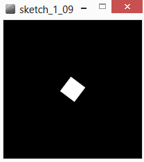

Si vous intervertissez rotate() et translate() l’effet ne sera plus du tout le même, idem si l’on oublie d’utiliser pushMatrix() et popMatrix().

Ce petit programme interactif sur openprocessing pourra vous aider à visualiser ce qui se passe : https://www.openprocessing.org/sketch/388513

[**home**](#Contenu)<br>


## Coder ses propres fonctions

A partir de ces transformations simples nous allons créer une texture mouvante en quelques lignes de code. Le principe est simple  nous allons utiliser le principe du carré tournant autour de son point supérieur gauche, mais nous allons créer une grille de carrés sur toute la surface de l’écran. 

Pour simplifier le code nous allons écrire une fonction.  Cette fonction aura pour objectif de dessiner un carré situé à des coordonnées spécifiques avec un angle de rotation propre. Cette fonction étant une fonction de dessin, elle sera de type « void », et elle acceptera les 3 paramètres sus-cités , on la déclarera de cette façon :

```java
void draw_rect(float xpos, float ypos, float rotation) {
	// suite d’instructions à écrire
}
```

Pour utiliser cette fonction il suffit alors de l’  « appeler » :

```java
draw_rect(50,50,PI/2) ;
```
On dessinera ainsi un rectangle au point de coordonnées (50,50), tourné d’un angle  de PI/2 radians, si le code écrit à l’intérieur de notre fonction est le bon. Heureusement nous avons appris à précédemment à faire exactement cela :
```java
void draw_rect(float xpos, float ypos, float rotation) {
	pushMatrix(); 
	fill(100,100,255,2);
	stroke(255,100,100,5);
	strokeWeight(2);
	translate(xpos, ypos); 
	rotate(rotation);
	rect(0, 0, 35, 35);  
	popMatrix();
}
```

Nous avons maintenant ce qu’il nous faut, il ne nous reste maintenant plus qu’à écrire notre code autour…  Pour animer notre image, nous allons utiliser une variable pour stocker l’angle auquel seront dessinés nos carrés, à chaque image (donc à chaque répétition de la boucle draw) nous allons augmenter la valeur de cet angle. Une petite astuce pour obtenir un rendu plus « ondulant » sera d’attribuer des valeurs d’angles différentes en fonction de la position du carré dans la grille !

Vous pouvez aussi le voire ici :
http://www.openprocessing.org/sketch/60014

et consulter la vidéo d'abe pazos de funprogamming dont ce code est tirée : http://funprogramming.org/35-A-grid-of-rotating-objects-creates-a-wave-of-rectangles.html

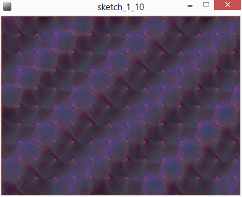

[**home**](#Contenu)<br>


## Interactions avec la souris et le clavier

Processing nous donne accès à des fonctions bien pratiques pour créer de l’interaction avec nos programmes, notament à travers l’utilisation de fonction spécifiques permettant d’intercepter les événements provenant de notre souris ou de notre clavier.


### Souris
Les évenements provenant de la souris peuvent être captés de diverses façon. Il est par exemple possible de connaitre la position de la souris à tout moment, de savoir quel bouton est activé etc.

#### Les variables relatives a la souris

Processing met à notre disposition différentes variables globales nous permettant de connaitre l’état de notre souris, ainsi :
**mouseX** et **mouseY** , nous permettent de connaitre les coordonnées de la position de la souris dans notre fenêtre à tout moment.

**mousePressed** : nous renvoi un booléen : TRUE si la souris est cliquée, FALSE sinon.
**mouseButton** : nous permet de connaitre l’identité du bouton qui a été cliqué

Le sketch_1_11 met en oeuvre ces variables en imprimant leurs valeurs dans la console.

Il existe aussi les variables pmouseX et pmouseY qui permette de connaitre la position de la souris à l’image précédente., combinées à mouseX et mouseY, il devient assez facile de calculer la vitesse de déplacement de la souris : 

```java
void setup() {
  size(200, 200);
  background(0);
  strokeWeight(4);
  frameRate(15);
  colorMode(HSB, 360, 100, 100);
}
void draw() {
  noStroke();
  fill(0, 25);
  rect(0, 0, width, height);
  stroke(random(360), 100, 100);
  line(pmouseX, pmouseY, mouseX, mouseY);
}
```

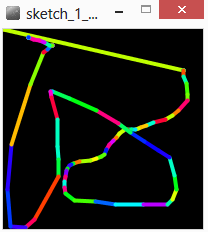

[**home**](#Contenu)<br>


#### Les fonctions relatives a la souris

Il existe aussi un certain nombre de fonctions permettant d’exectuer un bloc de code en fonction d’un événement souris :

* mousePressed() : lorsque l’on appuie sur un bouton.
* mouseReleased() : lorsque l’on relâche un bouton.
* mouseClicked() : lorsque l’on appuie puis que l’on relâche un bouton.
* mouseMoved() : lorsque l’on déplace la souris.
* mouseDragged() : lorsque l’on déplace la souris alors qu’un bouton est appuyé.
* mouseWheel() : lorsque l’on active la molette.

Toutes ces fonctions s’utilisent de la même façon : elles sont déclarés comme n'importe quelle fonction, le bloc présent entre les accolades est executé quand la fonction est déclenchée.

```java
void setup() {
  size(200, 200);
}

void draw() {
}

void mousePressed() {
  noStroke();
  fill(random(255), random(255), random(255), random(100, 180)); 
  ellipse(mouseX, mouseY, 15, 15);
}
```
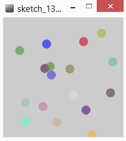

Un petit point cependant sur la fonction mouseWheel(),avec laquelle on peut obtenir le sens de déplacement de la molette, par le biais d’un MouseEvent.

```java
float hue=180;

void setup() {
  size(200, 200);
  colorMode(HSB,360,100,100);
}

void draw() {
  background(hue,100,100);
}

void mouseWheel(MouseEvent event) {
  float amt = event.getCount();
  hue +=amt;
}
```

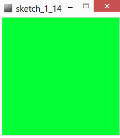

[**home**](#Contenu)<br>


### map()

La fonction map() peut s’avérer être très utile dans le cadre de divers programmes. Elle permet d’échelonner des valeurs d’un intervalle à un autre. Imaginons par exemple qu’en fonction de la position de la souris nous voulions changer la taille d’un cercle. 

Nous voulons que lorsque la souris est tout à gauche de l’écran, notre cercle soit petit (disons un diamètre de 5) et que lorsque nous sommes tout à droite notre cercle soir gros (un diamètre de 100). Nous savons déjà que lorsque notre souris est tout à gauche la variable mouseX aura pour valeur 0, lorsqu’elle est tout à droite sa valeur est de « width » (la variable globale contenant la largeur de notre fenêtre de dessin). La fonction map nous permettra alors de transformer la position de notre souris (comprise entre 0 et width) en une valeur comprise entre 5 et 100.

```java
	float diam ;
	diam = map(mouseX,0,width,5,100) ;
```

[**home**](#Contenu)<br>


### Clavier

De la même façon, les évènements claviers peuvent être interceptés. Il existes les variables :
 * **key**
 * **keyCode**

qui retournent les valeurs de la dernière touche de clavier enfoncée ; il existe aussi des fonctions similaires à celles de la souris :
 * **keyPressed()**
 * **keyReleased()**
 * **keyTyped()**

**keyTyped()**  va ignorer l’enfoncement des touches CTRL, ALT etc.

En fonction des machines, des systèmes d’exploitation ces fonctions et variables ne renvoient pas systématiquement les même valeurs. Attention donc pour le développement sur plusieurs plateformes.(Pour débugger il est conseillé d’avoir recours à des println pour vérifier les valeurs dans la console). Le chapitre suivant concernant le texte et les polices de caractère vous donnera un exemple d’utilisation de ces fonction.

[**home**](#Contenu)<br>


#### Dessiner du texte et utiliser des polices de caractere

Le programme suivant va permettre de stocker les lettres tapées sur notre clavier dans une variable de type String et va dessiner ensuite ces lettres de manière aléatoire sur l’écran. La fonction keyPressed() va gérer l’ensemble des interactions avec le clavier.

Pour dessiner du texte nous utilisons à la ligne 22 la fonction :
```java
text (string, int, int) ;
```

permettant de dessiner une chaine de caractère en spécifiant les coordonnées auxquelles la dessiner. Le rendu du texte est affecté par la fonction fill() comme n’importe quelle forme géométrique, mais ne réponds pas à la fonction stroke().

Deux autres fonctions permettent de modifier l’apparence du rendu du texte :
```java
textSize(float) ;
```

utilisée à la ligne 20, permet d’en changer la taille, et
```java
textFont(PFont) ;
```
permet de changer la police à la ligne21. Le type PFont est un objet permettant de charger une police externe chargée dans un fichier « *.vlw ».

On utilise donc une variable « font » de type PFont pour charger nos polices à la volée en fonction des touches enfoncées.

Concernant les interaction clavier, on utilise une technique de « castage » pour forcer le type de donnée que l’on va obtenir de la variable key. A la ligne 24, on s’assure que notre variable k sera bien un caractère avant de l’insérer dans notre chaine de caractères principale, à la ligne 25 on s’assure d’obtenir un entier pour avoir l’identifiant de la touche. Ensuite à l’aide de tests, nous définissons les action à effectuer.

```java
String buff = "        ";
PFont font;

void setup() {
  size(400, 300);
  background(255);
  colorMode(HSB);
  smooth();
  font =loadFont("Mosaicleaf-48.vlw");
}

void draw() { 
  noStroke();
  fill (255, 35);
  rect (0, 0, width, height);
  char k = buff.charAt(floor(random(buff.length()-1))); 
  fill(random(255), 255, 255);
  textSize(random(48, 100));
  textFont(font, 48);
  text(k, random(0, width), random(0, height));
}

void keyPressed() {

  char k = (char)key;
  int nkey = (int) key;

  if (nkey == 48) {
    font = loadFont("Mosaicleaf-48.vlw");
  }
  else if (nkey == 49) {
    font =loadFont("Bauhaus93-48.vlw");
  }
  else if (nkey == 50) {
    font =loadFont("HarlowSolid-48.vlw");
  }
  else if (nkey==51) {
    font =loadFont("Magneto-Bold-48.vlw");
  }
  else if (nkey == 51 || nkey ==52 || nkey ==53 ||nkey ==54
    || nkey ==55 ||nkey == 56 || nkey == 57) {
  }
  else if (key == BACKSPACE) {
    buff = "  ";
  }
  else {
    buff=k+buff;
  }
}
```

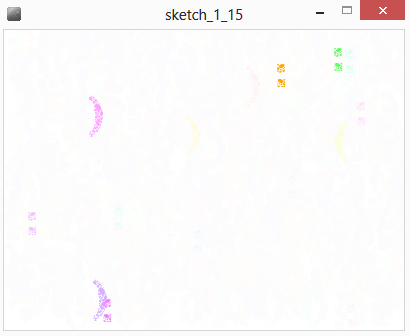

Il existe un outil permettant de construire des fonts au format .vlw et donc utilizable dans processing à partir des polices installées sur le système. Il suffit de cliquer sur le menu « Tools -> Create Font ».

[**home**](#Contenu)<br>


## Les Classes et la Programmation Orientee Objet

Les classes sont un des concepts centraux de JAVA, elles nous permettent de créer des objets ensuite manipulables par du code. Souvent une classe permet d’encapsuler un certain nombre de concepts ensembles d’un façon générique, et permet d’améliorer la lisibilité de notre code.

Cela peut paraître un peu barbare mais c’est en réalité relativement simple : un classe est la description théorique d’un objet. Par exemple dans ce chapitre nous allons créer un classe « Mover », cette classe permettra de créer un objet (représenté graphiquement par un cercle) qui se déplacera dans notre fenêtre de dessin et rebondira contre les bords.

### Structure d’une classe

Sa structure ressemble furieusement à la structure d’un programme processing. D’abord nous déclarerons des variables qui pourront être utilisées dans le code de notre classe. Ensuite il nous faudra une fonction pour initialiser ces variables , jusque là nous appelions ça la fonction « setup() », dans un classe cette fonction s’appelle un constructeur. Après cela nous aurons une ribambelle de fonctions qui seont appelées à chaque image calculée, qui nous permettra soit de dessiner quelquechose soit de modéliser un comportement physique, biologique , une interaction avec l’utilisateur etc.

```java
class Mover {
	// déclaration de variables
	// constructeur
	Mover(){
	// intialisation des variables
	}

	void update(){
	// faire des calculs
	}

	void draw(){
	// dessiner quelquechose
	}
}
```

[**home**](#Contenu)<br>


### Construction d'une classe simple


#### Declaration de variables

Pour construire notre classe Mover, nous allons utiliser un nouveau type de variable, le PVector. Cette variable est bien sûr l’équivalent d’un vecteur mathématique, son utilisation nous simplifiera grandement la vie pour l’implémentation du comportement physique que nous souhaitons. (rappelons tout de même qu’un vecteur n’est ni plus ni moins qu’un couple de coordonées).

Mover aura donc besoin pour fonctionner de deux vecteurs : un vecteur définissant la position de notre objet, et un vecteur définissant sa vitesse. Nous n’aurons donc que deux variables à déclarer :

```java
PVector loc, vel; 
```

[**home**](#Contenu)<br>


#### Constructeur et initialisation

Pour initialiser ces variales nous allons utiliser le même type de technique que lorsque nous avions écrit des fonctions. Nous allons nous attacher à pouvoir passer des arguments à notre objet. Cela signifie que lors de la création de l’objet, nous devrons nous même spécifier certaines valeurs, qui seront propre à cet objet crée. La classe elle n’a que faire de ses valeurs, elle ne les manipule que comme des valeurs symboliques. Sans surprise le constructeur resemblera donc à ça :

```java
Mover(PVector loc, PVector vel) {
    this.loc = loc;
    this.vel = vel;
}

```

Il est important de bien comprendre ici le fonctionnement du mot clé « this » qui peut créer une confusion. 

Dans notre classe nous avons déclarer deux PVector : ‘loc’ et ‘vel’. Nous avons fait de même entre les parenthèse de notre constructeur pour pouvoir passer des valeurs. Rappelez vous de la portée des variables (vue au tout début de ce document). Dans le cadre de notre constructeur nous avons donc deux fois, deux variables qui portent le même nom ; il faut donc impérativement être capable de les différencier. 

Le « this » sert à cela. Lorsque vous êtes dans cette situation le fait d’utiliser « this. » permet de signifier à notre programme que l’on parle de la variable de la classe, celle qui a été déclarée avant notre fonction.  Nous allons donc toujours avoir :

```java
this.maVariable = maVariable ;
```
Autrement dit on attribue à la variable qui est utilisée dans notre classe, la valeur que l’on spécifie en argument de notre fonction.

[**home**](#Contenu)<br>


#### Methodes update() et draw()

En physique, il existe un lien entre la position, la vitesse et l’acceleration. Si l’on dérive l’accéleration par rapport au temps on obtient la vitesse, si l’on dérive cette vitesse on obtient la position. Et inversement si on intégre la position par rapport au temps on obtient la vitesse et si on intègre la vitesse on obtient la position (vérifiez si vous ne me croyez pas  !). Pour nous cela signifie que pour calculer la position de notre objet à l’image suivante , il suffit d’ajouter la vitesse à notre position actuelle ! un petit tour rapide sur la page d’aide de PVector nous apprend qu’il existe une méthode « add() » pour ajouter deux objets PVector. La fonction update() de notre classe contiendra donc très certainement cette ligne de code :

```java
loc.add(vel); 
```

Il ne nous reste plus qu’à dessiner quelquechose … et ça nous savons déjà le faire.

```java
class Mover {

 PVector loc, vel;

 Mover(PVector loc, PVector vel) {
   this.loc = loc;
   this.vel = vel;
 } 

 void update() {  
    loc.add(vel);  
 }

 void draw() {
    pushStyle();
    noStroke();
    fill(255, 100);
    ellipse(loc.x, loc.y, 25, 25);
 } 
}
```

Voici donc notre classe quasi-complétée.  Il nous reste à utiliser des tests pour savoir si nos objets sortent de l’écran ; si c’est le cas il faut qu’ils rebondissent ! On écrit donc une nouvelle fonction spécifique.

```java
void check_collisions(){
	if (loc.x < 0 || loc.x> width) { // trop à gauche ou (‘||’) trop à droite
    	vel.x = -vel.x; // on inverse sa vitesse en abscisse
   	}
	// meme schema pour les collision en haut et en bas avec l’ordonnée
	if (loc.y<0 || loc.y > height) {
    	vel.y = -vel.y;
	}
}
```

[**home**](#Contenu)<br>


### Utilisation d'une classe simple

Maintenant notre classe écrite nous allons pouvoir l’utiliser. Vous trouvez peut-être que pour l’intant c’est beaucoup de code pour pas grand-chose, mais la magie de la programmation objet va commencer à opérer.

Notre classe écrite nous pouvons maintenant créer des objets que nous pourrons manipuler. Nous pouvons par exemple maintenant déclarer un nouvel objet Mover comme n’importe quel autre type de processing (int, float, string…).1. M1. Mover mov ;over mov ;

```java
Mover mov ;
```

Cette ligne déclarer un nouvel objet, pour l’instant notre objet n’existe cependant toujours pas, nous disons juste à notre ordinateur  que nous allons le créer. Nous allons le créer dans le setup() de notre programme, mais nous avons d’abord besoin de créer deux PVector que nous passerons en argument : un pour la position de notre objet, un pour sa vitesse. Ensuite nous pourrons créer un nouvel objet de type Mover en utilisant la syntaxe :

mov = new Mover(monVecteur1, mon Vecteur2) ;

Voici donc le code du setup complet d'un setup initialisant un objet Mover

```java
void setup() {

  size (800, 600);

  PVector initLoc = new PVector(width/2, height/2);
  PVector initAcc = new PVector(1.05, -2.25);
  mov = new Mover (initLoc, initAcc);
}
```

Remarquez, que la façon dont nous initialisons les PVector et notre objet Mover est quasi-identique. C’est normal puisque l’objet PVector est lui-même un classe, qui est déjà codée pour nous.

Notre objet est donc crée, il ne nous reste plus qu’à la manipuler et à l’afficher. Cette étape se passera donc dans le draw() :

```java
void draw() {
  background(180); // fond noir
  mov.update(); // calculer la position
  mov.draw();  // afficher notre forme
}
```

Le code assemblé est disponible dans *Sketch_2_01*. 

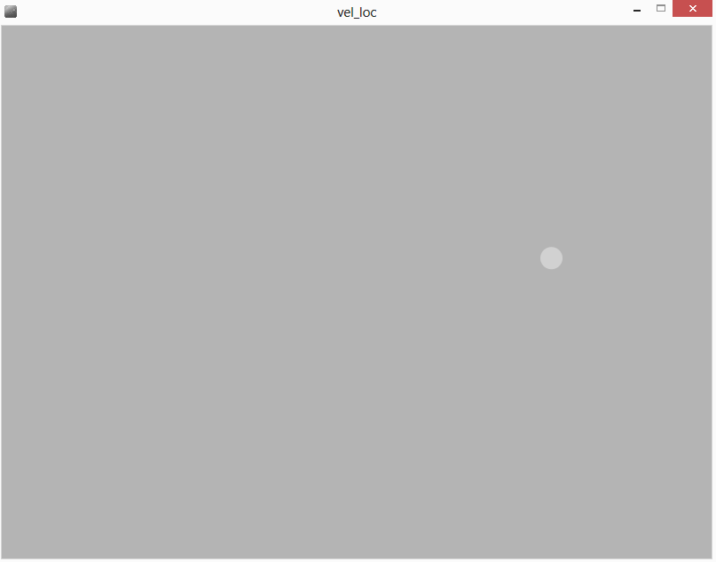

A priori cela représente beaucoup d'efforts pour peux d'avantages, mais l'usage conjoint de classes et de tableaux, permet de simplifier la manipulation de milliers d'objets.

[**home**](#Contenu)<br>


### Les Tableaux pour stocker des instances de classe

Les tableaux sont un type d’objets complexes, ils nous permettent de stocker un grand nombre d’éléments de n’importe quel type float, string …  ou même une classe que nous venons de créer. C’est précisément ce que nous allons faire. Cela nous permettra de traiter un maximum d’objet avec un minimum de lignes de code.

Pour créer un tableau nous devons connaitre le nombre d’éléments que nous allons stocker, il nous faudra donc d’abord définir une variable pour définir la taille de notre tableau. Ensuite un tableau se crée en utilisant des crochets ‘[‘ et ‘]’. Il nous faut d’abord définir le type d’objets que va contenir le tableau, puis ouvrir et fermer des crochets pour signifier que c’est un tableau, donner un nom à cet objet puis l’initialiser à l’aide du mot clé « new ». Pour créer un tableau de 100 objets Move, il suffit donc d’écrire ceci :

```java
int num = 100 ; 
Mover[] movs = new Mover[num];
```

Pour créer un tableau de 100 flottants :
```java
Float[] flottants = new float[100] ;
```

Maintenant que nous avons crée notre tableau, il nous faut initialiser les éléments qui le compose (dans le cas d’une classe) ou leur attribuer une valeur (dans le cas de flottants) pour cela nous allons utiliser une boucle for pour parcourir l’ensemble de ses  éléments.  Pour accéder à un élément précis, on utilise le nom du tableau et entre crochet l’index de l’élément auquel on veut accéder :

```java
flottants[5] = 10 ;
```
va attribuer la valeur 10 à l’index 5 de notre tableau de flottants.

Pour initialiser notre tableau d’objets Mover , nous allons parcourir l’ensemble du tableau à l’aide d’une boucle, et à chaque index nous allons stocker un nouvel objet en appelant le constructeur de notre classe.

```java
void setup() {
  size (800, 600);
  for (int i = 0 ; i < num ; i++) {
    PVector initLoc = new PVector(random(5, width-5), random(5, height-5));
    PVector initVel = new PVector(random(-1,1), random(-1,1));
    movs[i] = new Mover (initLoc, initVel);
  }
}
```
Enfin il ne nous reste plus qu’à utiliser nos objets dans le draw(), encore à l’aide d’un boucle for.

```java
void draw() {
	background(180); 
	for (int i = 0 ; i < num ; i++) {
    	movs[i].update();
    	movs[i].draw();
	} 
}
```

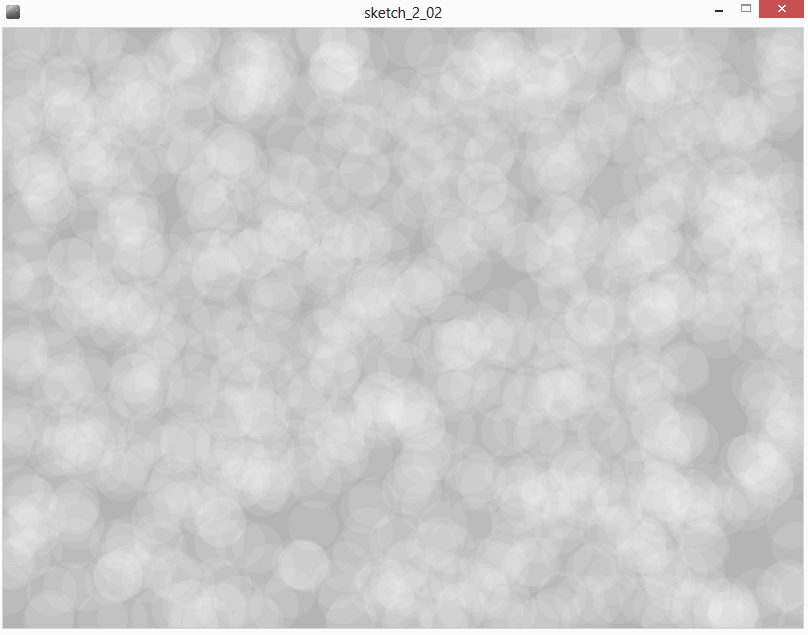

Nous avons donc maintenant 1000 objets Mover qui agissent indépendamment les uns des autres, et rebondissent sur les bords de notre fenêtre de dessin. 

[**home**](#Contenu)<br>


### Emergence - un programme interactif graphiquement complexe avec un algorithme simple

En repartant du programme précédent, nous allons nous attacher à représenter les choses d’un manière différente. Nous verrons qu’en changeant un peu de perspective nous arriverons à des résultats différents et graphiquement plus intéressants.

L’émergence en terme graphique peut être définie comme l’apparition de structures graphiques complexes et ordonnées à partir d’action simples.

Nous avons donc toujours un programme dessinant un certain nombre de particules qui se déplacent et rebondissent contre les bords de notre fenêtre de dessin. Au lieu de dessiner chaque particule individuellement, nous allons plutôt dessiner un lien entre deux de ces particules uniquement si la distance qui les sépare est inférieure à une certaine valeur.

Cette valeur sera un variable nommée « treshold », elle sera ajusté en fonction de la position de la souris à l’aide de la fonction map() à la ligne 21.Nous n’utilisons plus la fonction draw() de notre classe Mover, elle a donc disparu.

Pour dessiner ce lien nous allons devoir utiliser une double boucle pour parcourir deux fois notre tableau de movers, en faisant attention à gérer le cas où l’on fait référence au même objet :  à la ligne 27, nous vérifions que i est bien différent (« != ») de j.

Nous utilisons la fonction dist() pour calculer la distance entre les coordonnées des deux objets, puis si cette valeur est inférieur à notre treshold, nous dessinons une ligne utilisant ces mêmes coordonées aux lignes 28,29 et 30. Et voilà !

```java
int num = 1000;
Mover[] movs = new Mover[num];

void setup() {
  background(0);
  size (800, 600, P2D);
  for (int i = 0 ; i < num ; i++) {
    PVector initLoc = new PVector(random(5, width-5), random(5, height-5));
    PVector initVel = new PVector(random(-1, 1), random(-1, 1));
    movs[i] = new Mover (initLoc, initVel);
  }
}


void draw() {
  noStroke();
  fill(0, 50);
  rect(0, 0, width, height);

  stroke(255);
  float treshold = map(mouseX, 0, width, 0, 50);

  for (int i = 0 ; i < num ; i++) {
    movs[i].update();

    for (int j = 0 ; j < num ; j++) {
      if (i!=j) {
        float dist = dist(movs[i].loc.x, movs[i].loc.y, movs[j].loc.x, movs[j].loc.y);
        if (dist < treshold) {
          line(movs[i].loc.x, movs[i].loc.y, movs[j].loc.x, movs[j].loc.y);
        }
      }
    }
  }
}
 
class Mover {

  PVector loc, vel;

  Mover(PVector loc, PVector vel) {
    this.loc = loc;
    this.vel = vel;
  } 

  void update() {  
    loc.add(vel);  
    if (loc.x < 0 || loc.x> width) {
      vel.x = -vel.x;
    }
    if (loc.y<0 || loc.y > height) {
      vel.y = -vel.y;
    }
  }
}
```
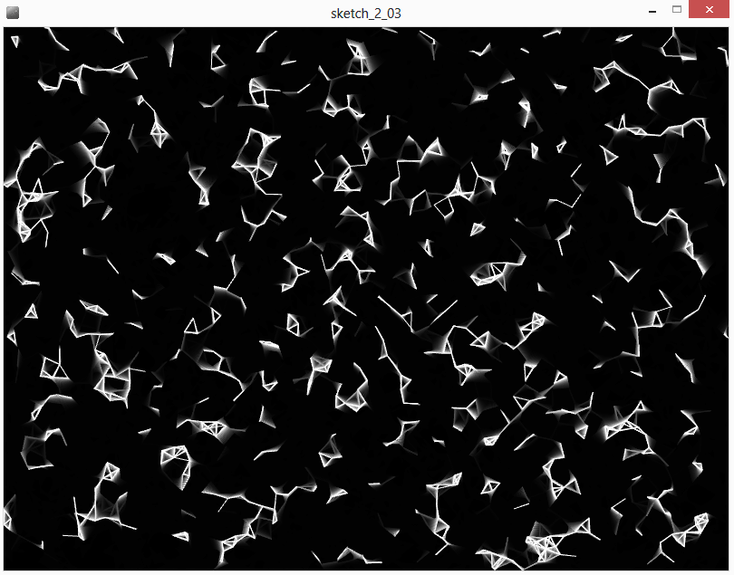

[**home**](#Contenu)<br>


## Travailler avec les images

Processing utilise un classe pour travailler avec les images, pour les manipuler nous avons recours à l’objet « PImage ».

### Charger et afficher une image

Pour charger et afficher une image dans Processing, il faut d’abord s’assurer qu’elle soit d’un type accepté par processing à savoir : .gif, .jpg, .tga, ou .png.

Il faut ensuite s’assurer qu’elle soit visible par le programme sur lequel on travaille. Pour cela il est préférable de sauvegarder le sketch, puis de glissr l’image à ajouter au sketch sur le fenêtre de processing. 

Dans le dossier du sketch en question (menu : Sketch -> Show sketch floder ) apparaitra alors un dossier nommé « data », qui contiendra votre image.

Une fois ces opération effectuées vous pouvez charger votre image comme ceci : 

```java
PImage img;

void setup(){
 
  img = loadImage("visage.jpg");
  size(600,400);  
  println(img.width, img.height);
   
}
 
void draw(){ 
   background(0);
   image(img,0,0); 
}
```

A la ligne 1 on crée un nouvel objet PImage appelé « img », on l’initialise à la ligne 5 en chargeant l’image présente dans le dossier data. En suite à la ligne 13, on affiche cette image, au point de coordonnées (0,0).

Ce code correspond au *Sketch_4_01.pde*.

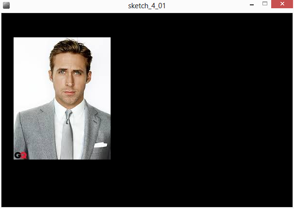

[**home**](#Contenu)<br>


### Acceder aux pixels

Une fois l’image chargée, il est possible de faire énormément de manipulations, il existe beaucoup d’exemples dans la documentation en ligne de processing a propos des filtres que l’on peut appliquer. Nous allons plutôt nous intéresser à la manipulation de pixels. 

Il existe une fonction appelée « loadPixels() » qui permet de charger automatiquement les couleurs des pixels d’une image dans un tableau qui se nommera pixels[]. 

Le code suivant permet de lire la teinte du pixel d’une image pré-chargée à l’endroit précis du curseur de la souris :

```java
PImage img ;

void setup(){ 
  background(0);
  img = loadImage("ville.jpg");
  size(img.width,img.height,P3D);   
}
  
void draw(){
   background(0);
   image(img,0,0);
   
   img.loadPixels();  
   int mousePos = mouseX + mouseY*width;
   println(hue(img.pixels[mousePos]));
   
}
```

Jusqu’à la ligne 14, normalement tout va bien. La ligne 15 va appeler la fonction loadPixels() sur l’image que nous avons chargée, cela aura pour effet de nous permettre d’utiliser le tableau de pixels à la ligne 17 (« img.pixels[] »). Nous utilisons directement la fonction hue pour connaitre la teinte du pixel en question (se référer à l’usage de la fonction hue(myColor) dans la documentation en ligne). 
Il faut cependant bien noter qu’à la ligne 16 nous convertissons les coordonnées de la souris en index linéaire dans un tableau.

En effet, pixels[] est un tableau, à titre chaque valeur est stockée à un index précis, mais cet index est à une seule dimension, alors que les coordonnée de la souris sont en 2D.

Cette pipette à couleur es disponible dans les exemples : *Sketch_4_02*.

[**home**](#Contenu)<br>


### Explosion de pixels en 3D

A partir de maintenant il devient très facilement possible d’effectuer tout un tas d’effets artistiques animés, en se basant sur les données des pixels. Dans le programme suivant nous allons nous attacher à déplacer les pixels en fonction de leur luminosité (et de la position de la souris, pour accentuer ou diminuer l’effet).

Afin d’avoir un programme plus rapide, nous allons avoir un setup() un peu plus long que d’habitude. En effet pour ne pas avoir à appeler la fonction loadPixels() en permanence, nous allons le faire une seule fois dans le setup de notre programme. Cela nous permettra de remplir des tableaux pour mieux organiser nos données et pouvoir ainsi les dessiner plus simplement. Comme précédemment nous allons parcourir chaque pixel de l’image à l’aide d’une double boucle for, et nous allons stocker dans des tableaux de même dimension, les coorodonnées en x dans le tableau xC[], les coordonnées en y dans le tableau yC[] et la couleur de chaque pixel dans le tableau pColor[].

```java
PImage img ;

int [] xC;
int [] yC;
int [] pColor;
 
void setup() {
  size(500, 400, P3D);
  background(0);
  img = loadImage("image_200x100.jpg");
  img.loadPixels();
 
  xC = new int[img.pixels.length];
  yC = new int[img.pixels.length];
  pColor = new int[img.pixels.length];

  for (int i =0 ; i < img.width ; i++) {
    for (int j = 0 ; j < img.height; j++) {
      int loc = i + j*img.width;
      xC[loc] =i;
      yC[loc] =j;
      pColor[loc] = img.pixels[loc];
    }
  }
}
```

Notez bien l’apparition du mode P3D dans l’instruction de taille de la fenêtre. Maintenant que nous avons ces informations, nous allons parcourir nos tableaux à chaque image et pour chaque valeur de l’index : créer un rectangle de la même couleur que le pixel d’origine et d’un taille de 1px X 1px, bref nous allons recréer l’image avec nos propres objets. La seule différence étant que nous allons ajouter une composante de translation en z, permettant de faire ressortir les pixels.

Pour obtenir l’effet souhaité, nous allons cependant le faire en deux fois. L’objectif est d’avoir l’image intacte quand la souris est à gauche de l’écran et « éclatée » quand la souris est à droite. A la ligne04 ci-dessous, nous allons donc définir une variable valant 0 quand la souris est à gauche et 60 quand la souris est à droite, ce que nous avions déjà fait précédemment.

Ensuite nous créons une boucle pour parcourir nos tableaux, nous stockons la luminosité de chaque pixel dans une variable à la ligne 07, puis nous nous apprêtons à dessiner avec des translations (usage du pushMatrix() …). La ligne 11 contient le positionnement de chaque forme : on décale de 150 pixels vers la droite et de 150 pixels vers le bas pour mieux centrer, puis on utilise les coordonnées stockées, en dernier paramètre on multiplie nos deux variable (position de la souris et luminosité) pour faire en sorte que les pixels les plus lumineux ressortent le plus.

```java
void draw() {
  background(0);
  float push_z = map(mouseX, 0, width, 0, 60);
  
  for (int i = 0 ; i < xC.length ; i++) {
    float br = brightness(pColor[i]);
    pushMatrix();
    noStroke();
    fill(pColor[i]);
    translate(150+ xC[i]+5, 150+yC[i]+5, push_z*br/20);
    rect(0, 0, 1, 1);
    popMatrix();
  }
}
```

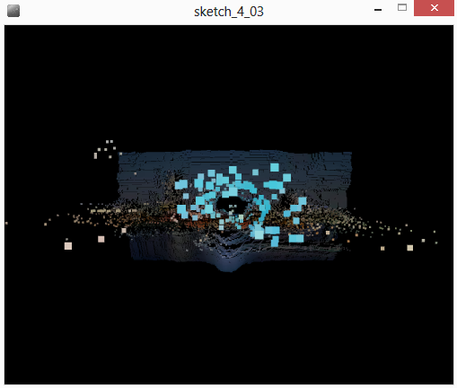

[**home**](#Contenu)<br>


## Les Librairies

Un des grands avantages de Processing est sa vibrante communauté d’utilisateurs, qui écrit des tutoriels, qui documentent et partagent leurs travaux. Les développeurs de Processing ont voulu permettre aux utilisateurs développer leurs propres librairies et de les intégrer dans Processing.

Il existe un grand nombre de librairies pour faire beaucoup de choses différentes : 
http://processing.org/reference/libraries/

Il en existe pour tout un tas d’applications : pour animer, pour contrôler de la vidéo, pour exporter ou importer des formats de données particuliers, pour faire de la 3d, de la typographie ou encore pour faire parler son ordinateur…

Nous allons nous intéresser principalement à deux librairies, une permettant de créer des boutons et des sliders pour contrôler nos sketch processing : controlP5. L’autre permettant de faire communiquer deux programmes entre eux. Ces deux librairies ont été codées par Andreas Schlegel (http://www.sojamo.de/code/), un grand merci à lui !


### Installation d'une librairie

Depuis la version 2.0 de processing, il existe un outil permettant d’installer facilement des librairies, c’est le « library manager » accessible depuis le menu « sketch -> Import library -> Add library ». 

Cet utilitaire permet de naviguer parmi les librairie disponibles de les installer ou de les supprimer. 

Si toute fois l’utilitaire ne fonctionnait pas bien, il existe un dossier spécifique dans notre sketchbook appelé « libraries » qui stocke toutes nos librairies installées. Pour rappel l’emplacement du sketchbook est modifiable dans « file -> Preferences ». Pour installer une librairie, il suffit de télécharger la librairie, de dézipper l’archive et de placer le dossier dans votre dossier « libraries »

Généralement une librairie est composée d’un dossier principal contenant quatre sous-dossier :
* /examples/
* /library/
* /reference/
* /src/

Dans le dossier /library/ vous devez normalement trouver un fichier *.jar portant le même nom que votre dossier racine. Si c’est bien le cas votre librairie sera alors reconnue et utilisable.

Généralement lorsque vous installez une librairie elle est fournie avec un certains nombres d’exemples censé expliquer son fonctionnement. On y accède via le menu File->Examples, il faut ensuite naviguer jusqu’au menu déroulant intitulé « Contributed Libraries », puis trouver le dossier correspondant à la librairie installée.

[**home**](#Contenu)<br>


### ControlP5 pour la creation de GUI 

ControlP5 est une librairie permettant des créer des GUI (« General User Interface »), c’est-à-dire des boutons et des glissières permettant de contrôler certains paramètres de notre programme.

En naviguant jusqu’à l’aide fournie avec la librairie, vous constaterez qu’elle est bien réelle et extensive (peut-être même un peu trop). 

Le dossier /controllers/, présente l’ensemble des éléments de GUI implémentés : allant du bouton, à la liste en accordéon, en passant par les doubles sliders (ControlP5range) et autres surface de type pad XY (ControlP5slider2D).

Les dossiers /extra/ et/use/, introduisent  quelques notions plus avancées, et notamment l’utilisation d’une fenêtre externe pour y placer les éléments de GUI. C’est l’exemple auquel nous allons nous intéresser.

```java
/**
 * ControlP5 Controlframe
 * by Andreas Schlegel, 2012
 * www.sojamo.de/libraries/controlp5
 *
*/
import java.awt.Frame;
import java.awt.BorderLayout;
import controlP5.*;
 
private ControlP5 cp5;
 
ControlFrame cf;

int def;

void setup() {
  size(400, 400);
  cp5 = new ControlP5(this);

  cf = addControlFrame("extra", 200, 200);
}
 
void draw() {
 background(def);
}
 
ControlFrame addControlFrame(String theName, int theWidth, int theHeight) {
 Frame f = new Frame(theName);
 ControlFrame p = new ControlFrame(this, theWidth, theHeight);
 f.add(p);
 p.init();
 f.setTitle(theName);
 f.setSize(p.w, p.h);
 f.setLocation(100, 100);
 f.setResizable(false);
 f.setVisible(true);
 return p;
}

```

Dans cette première partie, on commence par importer les librairies nécessaires. On utilise ControlP5, déclarée en ligne 9, mais aussi deux classes provenant directement de Java.awt (AWT = Abstract Window Toolkit), ce qui nous permettra de créer une seconde fenêtre pour notre programme. Nous auront aussi besoin d’une classe que nous adapterons suivant nos besoins, elle est donnée ci-dessous.
Après avoir appelé nos librairies, nous créons une instance de ControlP5 qui s’appelera « cp5 » à la ligne 11, qui sera initialisée à la ligne 19 dans le setup().

Ensuite nous créons un nouveau ControlFrame appelé « cf » à la ligne 13. ControlFrame signifie fenêtre de contrôle et sera donc notre seconde fenêtre dans laquelle nous placerons notre interface. Notez bien que lors de son initialisation à la ligne 21, nous appelons une fonction spécifique qui commence à la ligne 28 et s’achève à la ligne 39. Cette fonction va appeler les fonctions java que l’on a importé pour créer une fenêtre portant le nom que l’on aura spécifié en premier argument, et les dimensions en deuxième et troisième arguments. Cette fonction n’a pas besoin d’être modifiée et peut rester la même à chaque utilisation.

Dans cette fonction à la ligne 30, on appelle le constructeur de la classe ControlFrame décrite ci-dessous. Cela permet créer  la fenêtre de manière et de créer un lien entre les deux fenêtre, cela sort du cadre de cette introduction (« this » et « Object parent » y sont pour beaucoup). Il faut s’attarder sur la méthode setup() de cette nouvelle classe(lignes 47 à 53), pour comprendre comment ajouter des contrôleurs dans notre nouvelle fenêtre.

```java
public class ControlFrame extends PApplet {

  int w, h;
  int abc = 100;
  ControlP5 cp5;
  Object parent;

  public void setup() {
    size(w, h);
    frameRate(25);
    cp5 = new ControlP5(this);
    cp5.addSlider("abc").setRange(0, 255).setPosition(10, 10);
    cp5.addSlider("def").plugTo(parent, "def").setRange(0, 255).setPosition(10, 30);
  }

  public void draw() {
    background(abc);
  }

  private ControlFrame() {
  }

  public ControlFrame(Object theParent, int theWidth, int theHeight) {
    parent = theParent;
    w = theWidth;
    h = theHeight;
  }

  public ControlP5 control() {
    return cp5;
  }
}
```

En premier lieu notre classe fait appel à une nouvelle instance de controlP5 rattachée à cette nouvelle fenêtre (ligne 50). A la ligne 51, on crée un slider appelé « abc », qui va sortir des valeurs comprises entre 0 et 255, et qui sera situé à la position (10,10) dans la nouvelle fenêtre. De part son nom, les valeurs du slider « abc », seront directement stockées dans la variable du même nom.

A la ligne 52 on crée un second slider, cette fois appelé « def », qui va sortir le même type de valeurs, à la différence que ces données seront envoyées à notre fenêtre parente, et stockées dans notre variable de type entier « def ».

D’un façon générale, il est plus clair d’utiliser systématiquement fonction « .plugTo(this,myVar) » pour associer la valeur d’un gui à une variable. Dans notre exemple, on utilise « parent », pour spécifier qu’il s’agit d’une autre fenêtre que l’on a préalablement définit, mais l’utilisation de « this » permet de le faire aussi lorsque contrôles et dessins se passent dans la même fenêtre.

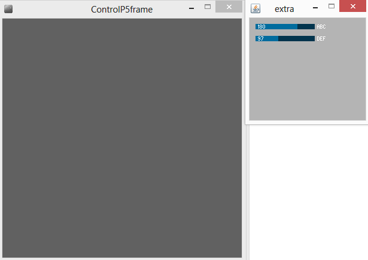

Une fois la librairie installée vous pourrez trouver un exemple ici :
File->Examples->ContributerLibrairies-> ControlP5->Extra->ControlP5frame.pde

ControlP5 est une librairie très aboutie avec beaucoup de fonctionnalités, mais sa mise en œuvre peut-être parfois un peu lourde. S’il s’agit de faire des tests, le mode « Tweak » peut  s’avérer être une bonne alternative.

[**home**](#Contenu)<br>


### OSCP5 pour la communication avec d’autres programmes

OSCP5 est un support pour processing de la fameuse librairie de communication entre différents paradigmes de programmation. OSC est présent dans quasiment tous les langages c’est donc un classique à connaitre et à utiliser sans modération.

Les exemples sketch_3_01_OSC_Receive.pde et sketch_3_01_OSC_Send.pde sont donc à utiliser conjointement. Le premier programme recevra des informations du second, et changera sa couleur de fond en fonction de la valeur reçue. Le second programme, enverra une valeur aléatoire lorsque l’on clique sur sa fenêtre.

Pour effectuer cela, il important de pouvoir spécifier une adresse ip pour pouvoir envoyer un message a un endroit précis et un numéro de port.

```java
//Receiver
import oscP5.*;
import netP5.*;

OscP5 oscP5;

float receivedValue;
 
void setup() {
  size(400, 400);
  frameRate(25);

  receivedValue =0;

  oscP5 = new OscP5(this, 1234);
}
 
void draw() {
  background(receivedValue);
}
 
void oscEvent(OscMessage theOscMessage) {
   if (theOscMessage.checkAddrPattern("/test")==true) {
     float firstValue = theOscMessage.get(0).floatValue();  
     String secondValue = theOscMessage.get(1).stringValue();
     receivedValue = firstValue;
   }
  }
}
```

Les lignes 2 et 3 permettent d’importer les objets nécessaires. La ligne 5 crée une instance d’OSCP5 La ligne 15, située dans le setup est primordiale pour le bon fonctionnement de notre programme, le second argument fourni (ici « 1234 » )  est nôtre numéro de port, cette ligne signifie donc que nous écouterons toutes les informations entrantes sur cette machine (« this ») transitant par le port « 1234 ».  Lorsqu’une telle information sera reçue, elle activera la fonction présente de la ligne 22 à la ligne 28.

Un message OSC est avant tout un préfixe « /test » ici, permettant de trier les messages arrivant puis un tableau remplit de variable de différents types, il est alors toujours plus pratique de savoir exactement ce que l’on va recevoir. Ici, comme vous pourrez le voire ci-après notre message est , d’un préfixe « /test » puis est composé : d’un float aléatoire, et d’un string constant. Pour accéder à l’élément « n » du message on utilise « theOscMessage.get(n) », puis on utilise l’accesseur approprié au type de valeur que l’on reçoit (« .floatValue() »  pour un float).

La ligne 23 reçoit donc une valeur flottante, la ligne 25 stocke cette valeur dans une variable qui va servir à spécifier la couleur de fond de notre fenêtre.

```java
// Sender
import oscP5.*;
import netP5.*;

OscP5 oscP5;
NetAddress myRemoteLocation;

void setup() {
  size(400, 400);
  frameRate(25);

  oscP5 = new OscP5(this, 12000);
  myRemoteLocation = new NetAddress("127.0.0.1", 1234);
}
 
void draw() {
   background(0);
}
 
void mousePressed() {

  OscMessage myMessage = new OscMessage("/test");
  myMessage.add(random(255));
  myMessage.add("hello!");
 
  oscP5.send(myMessage, myRemoteLocation);
}
```

Jusqu’à la ligne 6, rien de nouveau sous le soleil.

A la ligne 6, apparait cependant un nouvel objet propre à OSCP5 : un objet de type NetAdress, c’est en fait un couple composé d’une adresse ip et d’un numéro de port, comme vous pouvez le constater à la ligne 13.

Le reste du programme tient dans la fonction mousePressed() (lignes 21 à 29).  A la ligne 23 on crée un nouveau message avec un préfixe spécifique. A la ligne 25 on lui ajoute une première donnée (un nombre aléatoire), puis une seconde à la ligne 26. La ligne 28, envoit notre message à l’adresse que nous avons spécifié dans le setup.

N’oubliez pas de faire attention aux adresses ip et au numéros de ports lorsque vus utilisez OSCP5, n’hésitez pas non plus à faire des print pour être bien sûrs de recevoir vos messages !

Le Chapitre suivant vous donnera un exemple permettant de de commander Processing à l’aide d’une analyse audio faite dans Pure Data.

[**home**](#Contenu)<br>


###  3D et audio-reactif avec Pure-Data

Pour compléter le petit projet initié dans le chapitre sur les images, nous allons ajouter une partie audio-réactive, le temps pour Pure-Data et OSC de se rappeler à nos bons souvenirs…

Pour faire simple nous n’allons plus utiliser la souris pour contrôler la quantité de déplacement de nos pixels, mais plutôt le niveau sonore ambiant dans la pièce dans laquelle nous travaillons. Nous allons faire l’analyse audio dans Pure-Data puis envoyer les données via OSC à Processing.

En ce qui concerne le code Processing, nous prenons le programme précédent, auquel nous apportons quelques modifications, notamment pour ajouter la librairie OSCP5 et ajuster la réception des messages (un seul float avec le préfixe « /env »). Il faut aussi pense à la ligne 40 à changer la valeur de push_z en fonction des données que l’on reçoit.

```java
import oscP5.*;
import netP5.*;

OscP5 oscP5;

float r_env = 0 ;

PImage img ;

int [] xC;
int [] yC;
int [] pColor;
 
void setup() {
   size(500, 400, P3D);
   background(0);
   img = loadImage("image_200x100.jpg");
   img.loadPixels();
 
    oscP5 = new OscP5(this, 8600);
   
   xC = new int[img.pixels.length];
   yC = new int[img.pixels.length];
   pColor = new int[img.pixels.length];
 
   for (int i =0 ; i < img.width ; i++) {
     for (int j = 0 ; j < img.height; j++) {
       int loc = i + j*img.width;
       xC[loc] =i;
       yC[loc] =j;
       pColor[loc] = img.pixels[loc];
     }
   }
} 
 
void draw() {
  background(0);

  float push_z = map(r_env, 45, 90, 0, 60);
  
  for (int i = 0 ; i < xC.length ; i++) {
    float br = brightness(pColor[i]);
     pushMatrix();
     noStroke();
     fill(pColor[i]);
     translate(150+ xC[i]+5, 150+yC[i]+5, push_z*br/20);
     rect(0, 0, 1, 1);
     popMatrix();
  }
}
 
 
void oscEvent(OscMessage theOscMessage) {
   if (theOscMessage.checkAddrPattern("/env")==true) {
     float firstValue = theOscMessage.get(0).floatValue();  
     
     r_env = firstValue;
   }
}
```

Se référer au *Sketch_4_04*.
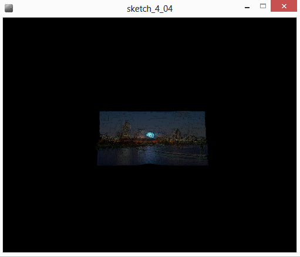


Le patch Pure-Data est quand à lui très simple : il utilise la librairie « mrpeach » qui permet l’utilisation de boites spécifiques à l’envoi de messages OSC.

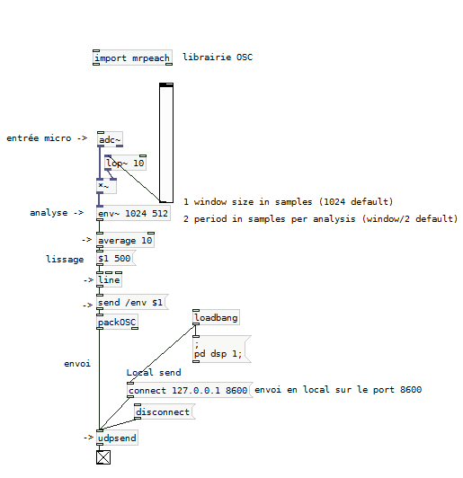

et voilà !

[**home**](#Contenu)<br>


## Trucs et astuces

Inspiré de la rubrique de Amnon sur son wordpress :
http://amnonp5.wordpress.com/2012/01/28/25-life-saving-tips-for-processing/

### IDE

* Ctrl + T : permet de formater le texte de notre code en le ré-indentant en fonction des accolades.
* File -> Preferences : emplacement du sketchbook
* File -> Examples : exemples de programmes classés selon différentes catégories, la documentation des librairies est aussi disponible sous cet onglet.	

### Programmation abréviation des opérations
```java
i = i+1 ;
```
 est équivalent à
```java
i+=1 ;
```

### Graphisme

#### Un blur très simple
Au lieu d’effacer le fond à chaque image en utilisant 
```java
background (maCouleur) ;
```
Il est très simple de créer un effet de « blur » en utilisant de la transparence.
```java
fill(0,20) ;
noStroke();
rect(0,0,width,height) ;
```

#### Color Selector
Utilisez l’outil Color Selector pour spécifier plus facilement vos couleurs dans les different modes.
Tools -> Color Selector.

### In/Out

#### Sauvegarder une image

Pour sauvegarder un image on peut utiliser la fonction saveFrame(), on peut la coupler avec une interaction clavier, ainsi qu’une condition pour que la sauvegarde s’effectue lorsqu’on appuie sur la touche S. Le must est de composer une chaîne de caractère pour que chaque fichier ait un nom unique.
```java
// function d’interception des évenements clavier
void keyPressed() {
 // condition pour identifier si la touche est un “s”
 if (key == 's' || key == 'S') {
  /* composition d’une string comportant le nom du sketch puis des informations de temps à l’aide de functions de processing pour récupérer des événements temporels*/
  String name = "monSketch-"+year()+"-"+month()+"-"+day()+"-"+hour()+"h"+minute()+"m"+second()+"s.png"
  saveFrame(name);
 }
}
```
#### Redimensionner une image

Il suffit de changer la taille de la fenêtre du programme pour sauvegarder une image au nouvelles dimensions.
```java
PImage img ;

void setup(){
  size(200,100,P3D);
  background(0);
  img = loadImage("ville.jpg");
  img.resize(width,height);  
}

 
void draw(){  
  background(0);
  image(img,0,0);
  saveFrame("image_"+width+"x"+height+".jpg");
  noLoop();
}
```

[**home**](#Contenu)<br>


## Ressources


### Ressources collaboratives

Page de ressources sur codelab (fr) : http://codelab.fr/39

Forum dédié à Processing (français) : http://codelab.fr/processing

Forum officiel de Processing (anglais) : http://forum.processing.org/

Plateforme de code ouverte : Openprocessing - http://www.openprocessing.org/

Code des workshops des Journées du Code Créatif 2014 dédiées à Processing : https://github.com/stereolux/JCC2


### Ressources officielles

Site officiel : http://processing.org/

La référence de l’API processing : http://processing.org/reference/

Le Wiki( parfois la référence n’est pas complète) : http://wiki.processing.org/w/Main_Page

Les tutoriaux officiels : http://processing.org/tutorials/

Plus à propos de processing :  http://en.wikipedia.org/wiki/Processing_(programming_language)


### Tutoriels écrits en français

Initiation (français) : http://fr.flossmanuals.net/processing/

Tutoriel (français) : http://www.ecole-art-aix.fr/rubrique81.html

D’autres tutoriels en français : http://tutoprocessing.com/tutos/


### Tutoriels vidéo en anglais

Vidéos de fun programming : http://funprogramming.org/

Vidéos de Daniel Shiffmann : https://www.youtube.com/user/shiffman/playlists

Computer programming for total beginner : https://vimeo.com/channels/introcompmedia

Nature of Code : https://vimeo.com/channels/natureofcode


### Livres en anglais

Generative Art de Matt Pearson - débutant : http://zenbullets.com/book.php

Nature of Code de Daniel Shiffman - intermédiaire (gratuit sur internet) : http://natureofcode.com/

Generative Design (en-fr) - intermédiaire : http://www.generative-gestaltung.de/

[**home**](#Contenu)<br>


## References


L'excellent **documentaire** : Hello World : https://vimeo.com/60735314

### Quelques exemples de code

My Code History : exemples de generative design revisités - http://mycodehistory.wordpress.com/

Abandoned Art de Matt Pearson - http://abandonedart.org/


### Tumblr

Processing : http://processing.tumblr.com/ 

fyprocessing: http://fyprocessing.tumblr.com/ 

p5art : http://p5art.tumblr.com/ 

hamoid : http://hamoid.tumblr.com/


### Artistes

Ben Fry : http://fathom.info/ 

Casey Reas : http://reas.com/pfft/

Aaron Koblin : http://www.aaronkoblin.com/

Karsten Schmidt: http://postspectacular.com/

Ira Greenberg : http://www.iragreenberg.com/ira_greenberg_data/index.html

Daniel Shiffman : http://shiffman.net/ 

Jer Thorpe : http://blog.blprnt.com/

Matt Pearson : http://zenbullets.com/

Lionel Raddisson : http://makio135.com/

Amnon Owed : http://amnonp5.wordpress.com/

Cedric Kieffer & Julia Laub : http://www.onformative.com/about/


### Quelques Videos et Projets

Processing exhibition : https://processing.org/exhibition/

Shadow Monsters de Philipp Worthington : https://www.youtube.com/watch?v=XNHv6VryB8o

The wilderness downtown de Chris Milk et Aaron Koblin : http://www.thewildernessdowntown.com

The Johnny Cash project de Chris Milk et Aaron Koblin : http://www.thejohnnycashproject.com  

Prisms de Matt Pearson : https://vimeo.com/75299268 

Tempest de Antoine Schmitt : https://vimeo.com/49065256

Written Images projet d'édition générative : http://writtenimages.net/

[**home**](#Contenu)<br>

