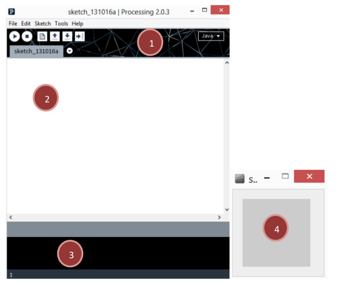
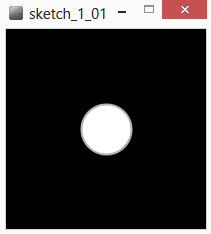
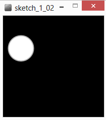
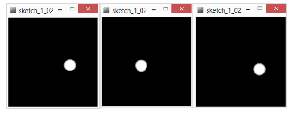
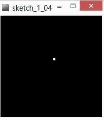
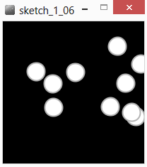
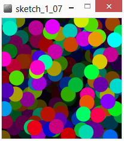
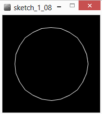

# Introduction_Processing
This respository is a french introduction to the Processing programming language

Notes : 
* Ce document ne se veut pas exhaustif, il présente les fonctions principales dont nous aurons l’utilité dans le cadre de ce cours. Processing étant très bien documenté il est très facile de trouver de nombreux tutoriels en ligne sur les différents aspects du programme. Se référer à la section « Ressources » pour plus d’informations.
* Ce document a pour but de rappeler les informations vues en cours sous une autre forme et d'en apporter de nouvelles, sa lecture doit donc s’accompagner des exemples de code construits pendant le module.


# Contenu
* [Introduction](#Introduction)<br>
* [L'IDE](#ide)<br>
* [Premier Programme](#Premier-Programme)<br>
* [Les variables](#Les-variables)<br>
 * [Définition](#définition)<br>
 * [Différents types de variables](#types)<br>
 * [La portée des variables](#portée)<br>
 * [Exemple d’utilisation des variables](#exemples)<br>
 * [Variables globales de processing](#globales)<br>
* [L’aléatoire](#L’aléatoire)<br>
 * [random()](#random)<br>
 * [noise()](#noise)<br>
 * [randomSeed() et noiseSeed()](#randomSeed)<br>
* [Les boucles](#Les-boucles)<br>
 * [for()](#for)<br>
 * [while()](#while)<br>
 * [Exemple](#exemple)<br>
* [Couleurs](#Couleurs)<br>
 * [Niveaux de gris](#gris)<br>
 * [Mode RGB](#rgb)<br>
 * [Mode HSB](#hsb)<br>
 * [Transparence](#transparence)<br>
* [Primitives de dessin](#Primitives-de-dessin)<br>
 *[Les instructions de dessin](#instructions)<br>
 *[Les primitives (formes prêtes à l'emploi)](#primitives)<br>
 *[Les vertices (formes sur mesure)](#vertices)<br>
* [Transformation de l’espace](#Transformation-de-l’espace)<br>
 *[translate()](#translate)
 *[rotate()](#rotate)
* [Coder ses propres fonctions](#Coder-ses-propres-fonctions)<br>	
* [Interactions Souris et clavier](#Interactions-Souris-et-clavier)<br>
* [Dessiner du texte et utiliser des polices de caractère](#Dessiner-du-texte-et-utiliser-des-polices-de-caractère)<br>
* [Les Classes Programmation Orientée Objet](#Les-Classes-Programmation-Orientée-Objet)<br>
* [Les Tableaux](#Les-Tableaux)<br>
* [Emergence : Un programme interactif complexe](#Emergence)<br>
* [Les Librairies](#Les-Librairies)<br>
* [Travailler avec les images](#Travailler-avec-les-images)<br>
* [Trucs et astuces](#Trucs-et-astuces)<br>
* [Ressources](#Ressources)<br>

<a name="Introduction"/>
#Introduction

Processing est un langage de programmation basé sur java et principalement destiné à la création
graphique. Il est apparut en 2001, crée par deux artistes Ben Fry et Casey Reas, alors étudiants au
MIT. Il reprend une partie des concepts de Design by Numbers l’environnement de programmation
graphique developpé par John Maeda au sein du Média Lab du même MIT.

Le langage processing est du Java fortement simplifié par l’accès direct à de nombreuses primitives
de dessin. Il a été crée spécialement dans le but de faciliter l’apprentissage des bases de la
programmation objet, via la création graphique permettant ainsi d’obtenir des résultats valorisants
très rapidement.

<p><i>
Processing seeks to ruin the careers of talented designers by tempting them away from their
usual tools and into the world of programming and computation. Similarly, the project is designed
to turn engineers and computer scientists to less gainful employment as artists and designers.
</i></p>

Au-delà du fait d’être un formidable outil de dessin et de prototypage rapide en terme de design
d’interaction. Processing est un réel langage de programmation capable de réaliser n’importe quelle
fonction.

Processing est un projet Open Source devenu collaboratif de par l’intérêt qu’il a suscité dès sa sortie.
Il est ouvert au développements tiers par l’intégration d’un système de librairie ainsi qu’une
documentation aidant au développement de librairies externes. Il existe aussi un système
de « modes » permettant d’ajouter des fonction à l’IDE (Itegrated Developpement Environment) de
processing comme le développement pour android (smartphones et tablettes), ou en javascript
(web).

Processing existe aussi bien sous Linux, Windows que Mac OS. Le projet étant à but pédagogique et
porté par une communauté très active il est excessivement bien documenté.

<a name="ide"/>
#L'IDE
IDE signifie Inegrated Developpemet Environment, c'est l'outil avec lequel on va travailler, c'est la fenêtre qu'ouvre notre système d'exploitation lorsque l'on lance processing. Cela ressemble à un éditeur de texte, mais nous avons des boutons pour compiler nos programmes et une seconde fenêtre de rendu qui s'ouvre à la compilation.



* La zone 1 correspond à la barre d’action, en haut à gauche se situe différents boutons : le premier « run » permet de lancer son programme, le second « stop » permet de le stopper. En dessous se trouve un système d’onglet, cela permet de mieux organiser son code quand les programmes deviennent plus complexes. Tout à droite se trouve un menu déroulant permettant de passer d’un mode à un autre (c’est-à-dire d’un developpement android à un developpement java classique par exemple).

* La zone 2 est un éditeur de texte classique permettant d’écrire son programme. Les mots clés du langage processing y apparaitront en surbrillance. Il est important de noter qu’à tout moment il est possible de consulter la documentation en ligne en effectuant un clic droit sur un mot clé et en sélectionnant « find in reference ».

* La zone 3 est la console qui renvoi les erreurs rencontrées par l’ordinateur lorsqu’il tente d’exécuter un programme. C’est aussi une zone d’information dans laquelle on peut choisir d’afficher des messages (à l’aide de la fonction println()).

* La zone 4 est la fenêtre d’exécution de notre programme. 

Processing fonctionne par défaut avec l’utilisation d’un « sketchbook ». C’est un dossier sur votre disque dur dans lequel seront stockés vos programmes et toutes les librairies, ainsi que les diférents modes que vous avez installé. Il est possible de modifier l’emplacement de ce dossier en allant dans : <i> File -> Preferences </i>

<a name="Premier-Programme"/>
#Premier Programme

A tout moment il est possible d’insérer un commentaire dans son programme en utilisant ces deux caractères en début de ligne  « // ». On peut aussi créer des commentaires sur plusieurs lignes en utilisant ces caractères :« / »  suivi de « * » pour signaler le début d’un commentaire, et de « * » suivi de « / » pour signaler la fin de ce même commentaire.

```java
// voici mon premier programme
void setup() {
  size(200, 200) ; // permet de spécifier la taille de la fenêtre.
  background(0) ; // utilisons un fond noir.
}
void draw() {
  background(0) ; // dessinons un fond noir.
  stroke(180) ; // on choisit de  dessiner un contour gris.
  strokeWeight(2) ; // ce contour aura un épaisseur de 2 pixels.
  fill(255) ; // le remplissage de notre dessin sera blanc.
  /* on dessine une ellipse située à 100 pixels du bord gauche, à 100 pixels du bord haut, d’une largeur de 50 pixels et d’une hauteur de 50 pixels … un cercle donc ! */
  ellipse(100, 100, 50, 50) ;
}

```


Ce programme se compose de deux parties principales, appelées aussi « fonctions » qui se démarquent par l’utilisation de mots clés **« void »** ainsi que la paire d’accolade **{** **}** qui délimite les instructions exécutées lors de l’appel de la fonction.

* Les lignes 02 à 05 : présentent la fonction **setup()**. Cette fonction est appelée une seule fois au démarrage du programme, c’est un initialisation.
* Les lignes 06 à 12 : présentent la fonction **draw()**, qui est le cœur du programme. La suite d’instruction enfermée entre les accolades est exécutée en boucle, le plus rapidement possible.

Il existe des fonction spécifique au langage processing appelée primitives, on peut les appeler simplement en utilisant leur syntaxe spécifique. Chaque fonction indiquée en surbrillance possède une documentation en ligne, il est fortement conseillé de s’y référer pour savoir comment les utiliser.

A noter que par défaut nous utilisons un systèmes de coordonnées cartésiennes centré en haut à gauche de la fenêtre de dessin. Dans notre programme, le coin en haut à gauche a donc les coordonnées(0,0), le coin en bas à droite a donc les coordonnées (199,199) 

<a name="Les-variables"/>
#Les variables

<a name="définition"/>
##Définition
Les variables correspondent à un espace utilisé dans la mémoire de l’ordinateur pour stocker une information de manière temporaire. Les variables peuvent être de différents types en fonction des données qu’elles doivent stocker.

<a name="types"/>
##Différents types de variables
**int** : permet de stocker des nombres entiers.
**float** : permet de stocker des nombres flottants soit des nombres à virgules.
**string** : permet de stocker des chaines de caractères, c’est-à-dire du texte.
**color** : permet de stocker une couleur.

Si on écrit :

```java

int a;
a = 5;
int b ;
b =3;
int result = a + b;
String operation = a +"+"+ b +"=";
println(operation);
println(result);

```

On crée une variable entière dont le nom est a, et on lui attribue la valeur 5. On crée une seconde variable entière dont le nom est b et on lui attribue la valeur 3. On crée ensuite un entier pour stocker le résultat que l’on obtient en additionnant les deux variables.

On crée ensuite une variable de type chaine de caractère pour inscrire l’opération effectuée puis son résultat dans la console. Une chaine de caractère doit être comprise entre deux " " pour être reconnue comme telle.  Ici on compose une chaine de caractère complexe en utilisant le symbole « + », les différentes chaines de caractères (ou caractères simples) qui la compose sont accolées.

Il est important de noter que si jamais notre variable appelée « result » avait été de type String, la ligne :

```java
String result = a+b ;
```

aurait renvoyé un tout autre résultat puisque les variables aurait été interprétée comme des String on aurait alors obtenu le juxtaposition des deux caractère soit « 53 ».

Certain type sont compatibles avec d’autres : on peut par exemple stocker un entier dans un flottant et des entiers ou des flottants dans des String. Cependant l’utilisation d’un flottant avec un type entier reverra nécessairement une erreur dans la console.

Il est aussi possible de stocker des données plus complexes comme des tableaux. Les tableaux servent à stocker des ensembles de données d’un type précis, on peut même y stocker des instances de classes… (nous verrons ceci dans la section dédiée aux classes).

<a name="portée"/>
##La portée des variables

Un point essentiel réside dans la portée de ces variables (en anglais on parle de « scope »). D’une façon simplifiée : une variable sera accessible uniquement dans la fonction ou portion de code dans laquelle elle aura été définie. Une portion de code correspond à l’espace entre deux accolades « { } ».

Cela signifie qui si je définie une variable dans le setup() de mon programme celle-ne sera accessible uniquement dans le setup().

Il est possible de définir des variables à l’extérieur des fonctions setup() et draw() : par exemple en tout début de programme, ces variables seront alors accessibles partout dans notre programme.

<a name="exemples"/>
##Exemple d’utilisation des variables

Habituellement on a tendance à créer les variables tout en haut de notre programme, on les initialise ensuite dans le setup() , puis on les utilise dans le draw().

```java
  // voici mon premier programme utilisant des variables
  color background_color ;
  int size ;
  float xpos,ypos ;
  
  void setup(){
  size(200,200) ;
  background_color = color(0) ;
  size = 50 ;
  xpos = random(100) ;
  ypos = random(100) ;
  background(background_color ) ; // utilisons un fond noir.
  }
  
  void draw(){
  background(background_color ) ; 
  stroke(180) ; 
  strokeWeight(2) ; 
  fill(255) ;
/* on dessine notre ellipse en utilisant nos variables*/
  ellipse(xpos,ypos,size,size) ; 
  }
```


<a name="globales"/>
##Variables globales de processing

Il existe dans processing des variables globales, qui sont donc accessibles partout dans processing, ces variables sont définies par défaut et gérée par processing lui-même, il faut mieux éviter d’utiliser leur nom pour définir ses propres variables.

C’est le cas entre autres de :

**width** : (float) qui est associée par défaut à largeur de la fenêtre de dessin.
**height** : (float) qui est associée par défaut à la hauteur de la fenêtre de dessin.

<a name="L'aléatoire"/>
#L'aléatoire

En informatique et en design génératif , l’aléatoire est très souvent utilisé pour obtenir des résultats présentant des variantes contraintes, c’est-à-dire pour obtenir plusieurs variations d’un même algorithme.

Il existe deux principales façon d’obtenir des nombres aléatoires ou plutôt pseudo-aléatoire, car il n’existe pas en informatique de méthode permettant d’obtenir un résultat réellement et statistiquement complètement aléatoire.

<a name="random"/>
##random()

La fonction random() renvoit donc des résultats aléatoires en fonction d’un argument qui sera spécifié entre les parenthèses. Ce nombre aléatoire sera de type float.
Par exemple :
```java
float nb_aleatoire = random(100) ;
println(nb_aleatoire) ;
 ```
nous obtiendrons avec ce code un nombre aléatoire compris entre 0 et 100.

Il est aussi possible de spécifier un borne supérieur, ainsi qu’un borne inférieure, ainsi :
```java
float nb_aleatoire = random(20,50) ;
println(nb_aleatoire) ;
```
renverra une valeur aléatoire comprise entre 20 et 50 ;

```java
/* voici mon premier programme utilisant des variables et de l’aléatoire */
int size ;
float xpos, ypos ;

void setup() {
  size(200, 200) ;
  size = 25 ;
  xpos = random(0, width) ;
  ypos = random(0, height) ;
  background(0 ) ; // utilisons un fond noir.
}

void draw() {
  background(0) ; 
  stroke(180) ; 
  strokeWeight(2) ; 
  fill(255) ;
  // à chaque image calculée on définit une nouvelle position
  xpos = random(0, width) ;
  ypos = random(0, height) ;
  /* on dessine notre ellipse en utilisant nos variables*/
  ellipse(xpos, ypos, size, size) ;
}
```

Ce programme va dessiner, à chaque image, un cercle positionné aléatoirement dans la fenêtre de dessin.



<a name="noise"/>
##noise()

La fonction noise() est un peu particulière puisque elle permet de générer des suites de nombres très proches les uns des autres. Cela permet notament de créer des mouvement et des contours qui paraissent plus naturels.

Son usage est un peu plus compliqué car il faut lui fournir un argument  « évolutif », celle-ci renvoi des valeurs comprises entre 0 et 1. Il faut donc souvent adapter le résultat obtenu en fonction de nos besoins.

```java
float noiseF; // facteur évolutif de notre fonction noise
float xpos, ypos; // coordonnées de notre forme

void setup() {
  size(200, 200);
  background(0);
  noStroke();
  fill(255);
  // on initialise notre facteur à une valeur aléatoire
  noiseF = random(500) ;
  // on place notre forme au centre de la fenetre.
  xpos = width/2;
  ypos = height/2;
}

void draw() {
  background(0);
  /* on ajoute à notre position une valeur comprise entre      -1 et 1, résultante de notre fonction noise. */
  xpos += noise(noiseF, 10, 20)*2-1;
  ypos += noise(noiseF, 85, 140)*2 -1;
  ellipse(xpos, ypos, 5, 5);  
  // on incrémente notre facteur noise d’une petite valeur
  noiseF += 0.005;
}
```


Ce programme dessine un cercle qui va se déplacer aléatoirement dans l’espace de dessin. Il est d’ailleurs fort probable qu’il en sorte, mais nous y reviendrons plus tard.

<a name="randomSeed"/>
##randomSeed() et noiseSeed()

Ces deux fonctions permettent de pouvoir retrouver un résultat qui a été obtenu avec des nombres aléatoires. Comme mentionné ci-dessus, les ordinateurs ne permettent pas d’avoir des générateurs de nombres complétement aléatoires, dans certain cas cela peut-être un avantage, notament quand il s’agit de pouvoir régénérer exactement la même image avec un algorithme qui utilise pourtant des nombres aléatoires.

Ces fonctions s’utilisent de la même façon ( exemples_pdf/Sketch_1_05.pde ) :

```java
int seed ;
seed = 123;

randomSeed(seed);
float a = random(500);
println("seed" + seed +" : " + a); 

seed = 52;
randomSeed(seed);
a = random(500);
println("seed" + seed +" : " + a); 

seed = 123;
randomSeed(seed);
a = random(500);
println("seed" + seed +" : " + a); 
```

<a name="Les-boucles"/>
#Les Boucles

C’est un des point primordiaux de la programmation objet, le boucles permette de répéter une action ou une suite d’instruction un nombre limité de fois. Il existe les boucles dites « for », et les boucles dites « while ». 

Dans le cadre de ce document nous n’allons traiter que les boucles «for », les boucles « while » étant relativement rarement usitées.

<a name="for"/>
##for()
voici un exemple de boucle « for » :

```java
for (int i  = 0 ; i < 10 ; i=i+1){
	noStroke() ;
	fill(255) ;
	ellipse (10+i*10, 10+i*10, 5,5) ;
}
```

Un boucle for se compose, de deux parties :

* Un bloc d’instructions à exécuter,  situé entre les deux accolades.

* Entre les parenthèses  ce sont les conditions d’exécution de la boucle qui sont séparées par des points virgules. 
 * D’abord, on définit un nombre entier appelé « i » que l’on initialise à  0, 
 * ensuite on précise que l’on exécutera le bloc d’instruction uniquement si  « i » reste strictement inférieur à 10, 
 * puis on incrémente « i » de 1 en lui ajoutant la valeur 1.

Le code présenté ci-dessus permet donc de dessiner 10 cercles blancs de 5 pixels de diamètre, le premier étant situé en haut à gauche aux coordonnées (10,10), le dernier au coordonnées (100,100).(100 = 10 + 9*10).

Comme nous le verrons ces boucles sont très utilisées en programmation objet car elles permettent d’itérer une série d’instructions sur les éléments d’un tableau.

<a name="while"/>
##While()

La boucle while() est moins usitée en programmation objet, mais très commune en électronique, elle permet de réaliser un bloc d’instruction tant qu’une condition est vérifiée.

```java
int i =0 ;
while (i < width){	
noStroke();
fill(255);
      ellipse(i,height/2,5,5);
i+=5;
}
```
Ici, nous avons un variable initialisée à zéro, tant que cette variable est inférieure à la largeur de notre fenêtre de dessin, nous dessinons une ellipse blanche, de 5 pixels de diamètre placée en abscisses à la valeur de « i » et en ordonnées au milieu de notre fenêtre de dessin.

<a name="exemple"/>
##Exemple

```java
/* voici mon premier programme utilisant des variables et de l’aléatoire et une boucle for*/
int size ;
float xpos,ypos ;
  
void setup(){
  size(200,200) ;
  size = 25 ;
  xpos = random(0,width) ;
  ypos = random(0,height) ;
  background(0 ) ; // utilisons un fond noir.
}
 
void draw(){
  background(0) ; 
  stroke(180) ; 
  strokeWeight(2) ; 
  fill(255) ;
  for (int i = 0 ; i <10 ; i++){
  // à chaque image calculée on définit une nouvelle position
  xpos = random(0,width) ;
  ypos = random(0,height) ;
  ellipse(xpos,ypos,size,size) ; 
  }
}
``` 




<a name="couleur"/>
#Couleur

<a name="gris"/>
##Niveaux de gris

Dans processing il existe trois mode principaux de couleurs. Le premier mode est celui que nous avons déjà utilisé dans les exemples précédents : le mode grayscale ou niveau de gris. Dans ce mode il s’agit de signifier un nombre entre 0 et 255 ; 0 étant le noir et 255 le blanc.

```java
stroke(0) ;
fill(180) ;
ellipse(width/2,height/2,50,50) ;
```
Le code va donc dessiner un cercle gris souris avec un contour noir.

<a name="rgb"/>
##Le mode RGB

Le mode de couleur par défaut de processing est le mode RGB (« Red Green Blue »), pour créer des couleurs il s’agit alors de spécifier les niveau de rouge, vert et de bleu que l’on souhaite entre 0 et 255 ;

```java
noStroke() ;
fill(255,0,0) ; // Rouge
ellipse(width/5,height/2,10,10) ;
fill(0,255,0);// Vert
ellipse(width*2/5,height/2,10,10);
fill(0,0,255);// Bleu
ellipse(width*3/5,height/2,10,10);
fill(255,100,100);// Rose
ellipse(width*4/5,height/2,10,10);
```

<a name="hsb"/>
##Le mode HSB

Le mode HSB correspond à la specification de niveau de Hue (teinte), Saturation (contraste), Brightness (luminosité). Lorsque l’on définie le mode HSB on spécifie généralement l’étendue de la plage que doivent occuper ces valeurs.

```java
colorMode(HSB,360,100,100) ; 
```

Cette ligne précise que l’on va spécifier les valeurs de teinte entre 0 et 360, les autres valeurs seron spécifiées entre 0 et 100.
Ce mode rend très facile la création de dégradés.

```java
size(360,100) ;
colorMode(HSB,360,100,100) ;
for (int i =0 ; i < width ; i++){
   stroke(i,100,100);
   line(i,0,i,height);
}
```

<a name="transparence"/>
##La transparence

Il suffit d’ajouter un paramètre final à nos couleurs quelque soit le mode choisit. Ce dernier paramètre réglera le niveau de transparence à spécifier entre 0 et 255 ; 0 étant complétement transparent (soit invisible) et 255 étant entièrement opaque.

Dans la création graphique la superposition de plusieurs couches transparentes donne des effets de textures souvent intéressants. L’utilisation de la transparence dans certain cas facilite l’émergence de motifs complexes.

```java
/* voici mon premier programme utilisant des variables et de l’aléatoire et une boucle for et de couleurs !*/
int size ;
float xpos, ypos ;

void setup() {
  size(200, 200) ;
  size = 25 ;
  xpos = random(0, width) ;
  ypos = random(0, height) ;
  colorMode(HSB, 360, 100, 100) ;
  background(0 ) ;
}

void draw() {
  // blur « maison »
  fill(0, 20) ;
  rect(0, 0, width, height) ;
  noStroke() ; 
  for (int i = 0 ; i <10 ; i++) {
    xpos = random(0, width) ;
    ypos = random(0, height) ;
    fill(random(360), 100, 100) ;
    ellipse(xpos, ypos, size, size) ;
  }
}
```




<a name="Primitives-de-dessin"/>
#Primitives de dessin

A partir de maintenant nous allons abandoner notre programme fil-rouge, qui nous a déjà appris beaucoup de choses, pour nous pencher vers d’autres rendus graphiques plus riches.

<a name="instructions"/>
##Les instructions de dessin

Nous avons déjà vu la majeure partie des instructions de dessins dans les programmes précèdents, mais opérons tout de même à un petit rappel : 

 * stroke() ; (color)  permet de définir la couleur du trait de dessin.	
 * strokeWeigth() ; (float) permet de définir l’épaisseur de ce trait.
 * noStroke() ; autorise à ne pas dessiner de contour.
 * fill() ; (color) permet de définir la couleur de remplissage d’une forme.
 * noFill() ; autorise à ne pas coloriser une forme.

Concenant les instruction de lignes, il existe aussi les fonction strokeCap() ;(String) et strokeJoint() ; (String) dont je vous invite à consulter la documentation en ligne.

Une autre instruction est importante , il s’agit de smooth() ; qui permet de modifier les paramètres de l’anti-aliasing de processing. On peut lui attribuer les valeurs de 2, 4 ou 8. Cela permet d’avoir des lignes fines plus précises à haute résolution.

<a name="primitives"/>
##Les primitves (formes)

Nous avons pour l’instant principalement utilisé des ellipses pour nos code. Mais processing regorge d’une bonne quantité de primtives pour dessiner différentes formes géométriques.

* ellipse(x-coord, y-coord, width,heigth) ; permet donc de dessiner une ellipse
* line(x1-coord, y1-coord, x2-coord, y2-coord) ; permet de dessiner une ligne entre les points (x1,y1) et (x2,y2) ;
* rect(x-coord,y-coord,width,height) ; permet de dessiner un rectangle, on peut lui adjoindre jusqu’à quatre autres paramètres pour spécifier l’arrondi de chaque angle.
* quad(x1, y1, x2, y2, x3, y3, x4, y4) ; permet de dessiner un quadrilatère.
* triangle(x1, y1, x2, y2, x3, y3) ; permet de spécifier un triangle.

Il existe souvent différent modes pour dessiner ces formes, je vous conseille donc de regarder les documentation de rectMode() (String) et ellipseMode() (String) par exemple. On peut par exemple choisir de dessiner à partir d’un coin (CORNER - par défaut lorsque l’on dessine un rectangle), ou à partir du centre de nôtre forme (CENTER – par défaut pour l’ellipse).

<a name="vertices"/>
##Les vertices (formes sur mesure)

Si cela ne vous suffisait pas il existe d’autres possibilités pour créer des formes. Les fonctions beginShape(), endShape() et vertex() vont nous y aider.

Un vertex n’est en fait ni plus ni moins qu’un couple de coordonnées, conjugé à beginShape() et enShape(), il permet de créer des ensembles de points à relier entre eux qui peuvent alors créer des formes complexes. Nous allons nous intéresser à la façon dont il est possible de dessiner un cercle à l’aide de ces fonctions.

Pour rappel, voici un cercle trigonométrique : 

http://www.openprocessing.org/sketch/151087

Alors que les coordonnées cartésiennes utilisent l’abscisse et l’ordonnée d’un point pour le placer dans le plan, les coordonnées polaires utilisent le rayon et l’angle pour définir un point de l’espace. En terme de code informatique il est donc assez facilement imaginable de tracer un cercle à l’aide d’un boucle « for » permettant de parcourir les 360° (ou 2*PI pour ceux qui préfèrent les radians), cependant il nous faut un moyen de passer des coordonnées polaires aux coordonnées cartésiennes (processing et la fonction vertex() demandent en effet un couple de coordonées).

Le cercle trigo nous permet de nous souvenir simplement de ces formules : le point noir sur le cercle à pour coordonées (x,y) dans un repère cartésien et (r,theta) en coordonnées polaires. 

Dans le programme interactif ci dessus, la projection bleue sur l’axe des abscisses nous donne la coordonnée x et correspond à un facteur près au cosinus de l’angle. La projection fuchsia sur l’axe des ordonnées nous fournit la coordonnée y qui est aussi proportionnelle à l’angle, mais cette fois au sinus :

```java
X = rayon * cos (angle)
Y = rayon* sin(angle)
```

beginShape() va vous permettre de signaler à Processing que vous allez commencer à dessiner une forme, il attendra donc un instruction de fin de dessin qui sera endShape() et aussi une liste de vertex() entre les deux pour définir les différents points à relier entre eux.

```java
float xpos, ypos ;
int radius; // le rayon de notre cercle
float step; // l’incrément de l’angle qui va parcourir une rotation de 360°

void setup() {
  size(200, 200);
  background(0);
  xpos = width/2;
  ypos = height/2;
  radius = 75;
  step = PI/12;
}

void draw() {
  background(0);
  noFill();
  stroke(255);

  beginShape();// on démarre notre forme
  for ( float angle = 0 ; angle <TWO_PI ; angle += step) {
    // on applique la formule vue précédement
    float ex = xpos + radius *cos(angle);
    float wy = ypos + radius *sin(angle);
    // on ajoute un vertex
    vertex(ex, wy);
  }
  endShape(CLOSE);// on arête notre forme et on la ferme
}
```


Il est important de noter que ces objets sont très puissant et peuvent être manipulés avec différentes options pour obtenir des résultats divers.

Par exemple : beginShape(), peut prendre un argument  qui affectera la façon dont la forme sera dessinée. beginsShape(POINTS) dessinera des points, beginShape(LINES) dessinera des lignes,  beginShape(TRIANGLES) constituera des triangles etc.

Pour plus d’informations, il peut-êre utile de se référer à le documentation de Processing concernant beginShape().  Il peut-être intéressant aussi de regarder les fonction beginContour() et endContour().

Concernant les vertices, il existe aussi plusieurs type de fonctions permettant de les utiliser : curveVertex(), bezierVertex(), quadraticVertex() sont d’autres façons de définir des vertices demandant plus ou moins d’arguments et donc plus ou moins simples à mettre en œuvre.

Enfin pour ceux qui persiste dans l’utilisation de processing, il est intéressant de regarder le foncionnement de l’objet PShape, qui permet de créer des formes complexes,  de les stocker puis de les manipuler plus facilement.

<a name="Transformation-de-l’espace"/>
#Les Transformation de l’espace

C’est un des points primordiaux de processing, il faut savoir se repérer dans un espace 2D et savoir utiliser différents systèmes de coordonnées, pour pouvoir se faciliter la vie.

Il existe deux types de transformation de l’espace :

* translate() ;
* rotate() ;

<a name="translate"/>
##translate()

Cette fonction permet d’opérer une translation, ce qu’il est primordial de comprendre c’est que l’on n’opère pas cette translation sur les formes que l’on dessine, mais plutôt sur notre espace de dessin. C’est comme si l’on gardait notre crayon au même endroit et que l’on déplaçait la feuille.

Par exemple :

```java
ellipse(width/2,height/2,25,25) ;
translate(50,0) ;
ellipse(width/2,height/2,25,25) ;
```

dessinera deux cercles côte à côte séparé dont les centre seront séparés de 50 px. Ce programme est équivalent à : (c’est une question de style)

```java
translate(width/2,height/2) ;
ellipse(0,0,25,25) ;
translate(50,0) ;
ellipse(0,0,25,25) ;
```
remarquez bien que les translations s’enchaînent, il est possible cependant de replacer la feuille à sa position par défaut en utilisant pushMatrix() et popMatrix(). Bien que cela puisse paraître compliqué il suffit de comprendre que si l’on dessine avec translate() il est parfois plus simple d’encadre chaque forme que l’on dessine de ces deux fonctions comme dans l’exemple ci-dessous :

```java
pushMatrix() ;
translate(width/2,height/2) ;
ellipse(0,0,25,25) ;
popMatrix() ;
pushMatrix() ;
translate(width/2+50,height/2) ;
ellipse(0,0,25,25) ;
popMatrix() ;
```java

translate en réalité déplace notre repère de dessin, par défaut le centre de notre repère (le point de coordonnées (0,0) ) est situé en haut à gauchede notre fenêtre. En utilisant translate(xpos,ypos) ; nous déplaçons ce centre au point de coordonnées (xpos,ypos).
Ré-écrivons notre programme fil-rouge avec des tranlate().

```java
/* voici mon premier programme utilisant des variables et de l’aléatoire et une boucle for et de couleurs ! et des translate(), pushMatrix(), popMatrix()*/
int size ;
float xpos,ypos ;

void setup(){
	size(200,200) ;
	size = 25 ;
	xpos = random(0,width) ;
	ypos = random(0,height) ;
	colorMode(HSB,360,100,100) ;
	background(0 ) ; 
}

void draw(){
	// blur « maison »
	fill(0,20) ;
	rect(0,0,width,height) ;
	noStroke() ; 
	for (int i = 0 ; i <10 ; i++){
	xpos = random(0,width) ;
	ypos = random(0,height) ;
	fill(random(360),100,100) ;
	pushMatrix() ; // on replace la feuille à chaque image
	translate(xpos,ypos) ;// on se déplace
	ellipse(0,0,size,size) ; // on dessine
	popMatrix() ; // objet parent de pushMatrix
	}
}
```

popMatrix() permet en fait de replace la feuille pour dessiner éventuellement d’autres choses après. Ces deux objets doivent impérativement être utilisés conjointement, l’un sans l’autre renverra une erreur…

<a name="rotate"/>
##rotate()

rotate() fonctionne de la même façon que translate(), il faut lui fournir un angle en radians, une fonction radians(angle)  permet de convertir un angle spécifié en degrés en une mesure radian facilement.

Il existe des variante de rotate que sont rotateX(), rotateY(), rotateZ() sur lesquelles nous ne épancheront pas.

En utilisant rotate(), il est nécessaire encore une fois de bien pense au système de coordonnées. Si par exemple je dessine un cercle au mileu tout en haut de ma zone de dessin :

```java
ellipse(width/2,0,50,50) ;
```

je peux faire en sorte que ce cercle se retrouve au centre en opérant un rotation de 45° ou PI/4 radians :

```java
rotate(radians(45)) ;
ellipse(width/2,0,50,50) ;
```
Cela commence intéressant lorsque l’on combine translate() et rotate() ensemble, je peux par exemple très facilement faire tourner un carré sur lui-même. En utilisant le mode CENTER (à la fin de ce paragraphe [ici](#primitives)).

```java
float angle ;
void setup() {
  size(200,200);
  angle = 0 ;
  rectMode(CENTER) ;// rappelez vous les modes !
}
void draw() {
  background(0) ;
  stroke(255) ;
  pushMatrix();// on s’assure d’avoir un repère bien à nous
  translate(width/2, height/2) ;// on déplace notre repère
  rotate(angle);// on le fait tourner
  rect(0, 0, 25, 25);// on dessine un rectangle
  popMatrix();
  angle += PI/24;// on incrémente l’angle
}
```


Si vous intervertissez rotate() et translate() l’effet ne sera plus du tout le même, idem si l’on oublie d’utiliser pushMatrix() et popMatrix().


